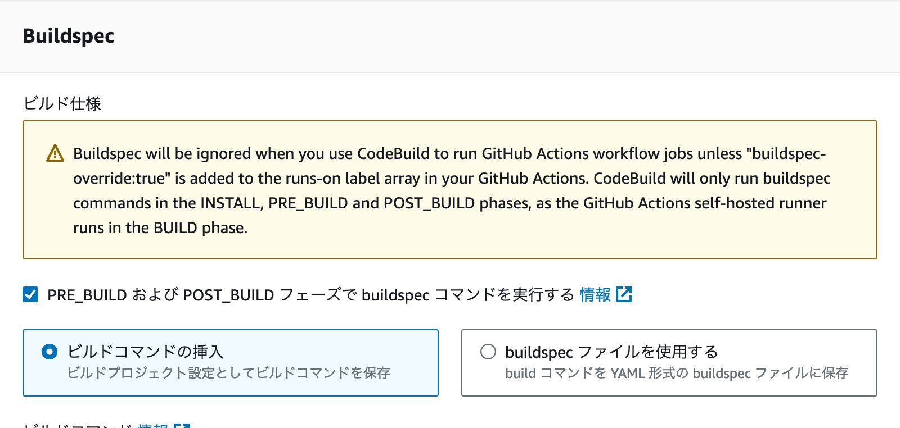
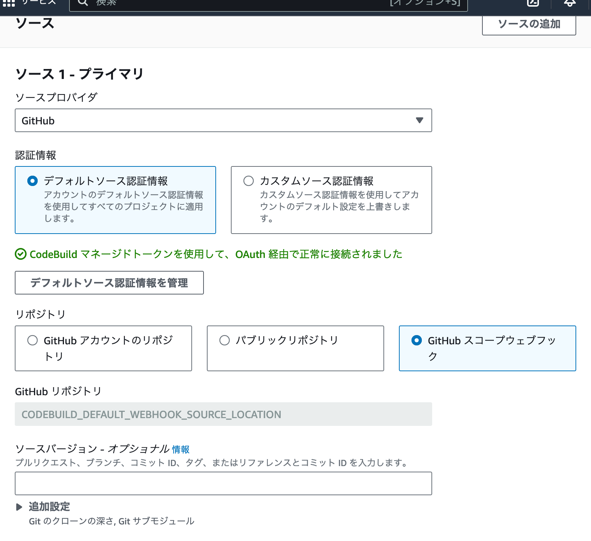
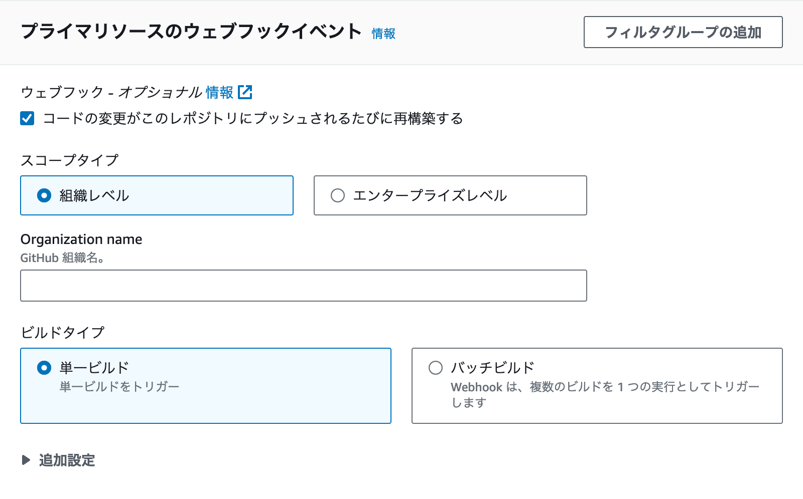
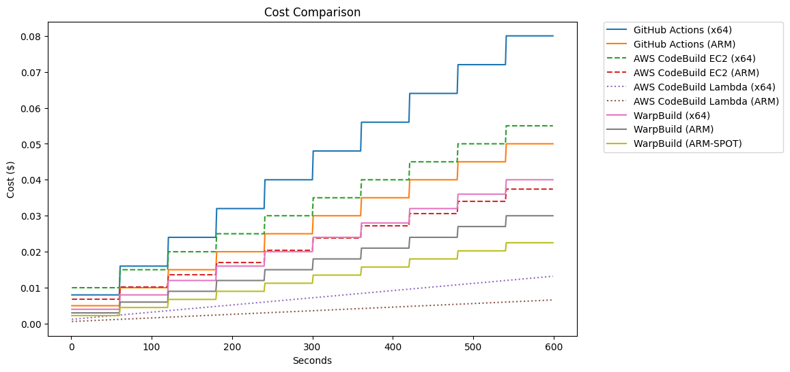
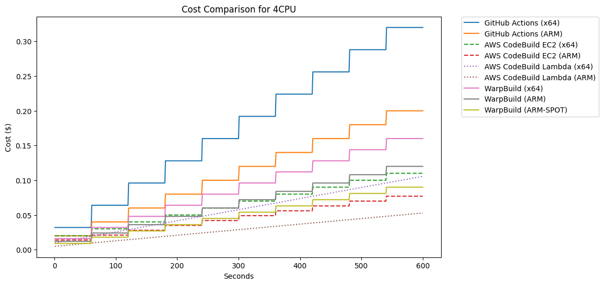

<div class="doc-header">
  <h1>GitHub ActionsのSelf-hosted RunnerをAWS CodeBuildで動かす</h1>
  <div class="doc-author">k_kojima</div>
</div>

# GitHub ActionsのSelf-hosted RunnerをAWS CodeBuildで動かす

https://docs.aws.amazon.com/codebuild/latest/userguide/action-runner.html に記載のある、AWS CodeBuildをGitHub ActionsのSelf-hosted Runnerとして使用可能な機能を試します。

2024-09-20時点での内容です。最新情報は上記ドキュメントを参照ください。また実際に動かしてみるのが一番わかると思います。 普段はGitHub ActionsをGitHub-hosted Runnerで動かしているので、CodeBuildにはあまり慣れていません。CodeBuild使っていれば常識的な部分もあるかもしれません。

## 基本的な使い方

AWS CodeBuild上でGitHubに接続設定したプロジェクトを用意し、その名前をGitHub Actionsのyamlの `runs-on` に記載することで動作します。
Terraformで表すと以下のような設定です。CodeBuildの名前は"github_runner"としています。

```terraform
resource "aws_codebuild_project" "main" {
  name               = "github_runner"
  service_role       = aws_iam_role.cb.arn
  project_visibility = "PRIVATE"
  badge_enabled      = false

  artifacts {
    type = "NO_ARTIFACTS"
  }
  source {
    buildspec           = <<-EOF
version: 0.2
phases:
  build:
    commands:
      - echo "Hello"
EOF
    git_clone_depth     = 1
    insecure_ssl        = false
    location            = "https://github.com/OWNER/REPOSITORY.git"
    report_build_status = false
    type                = "GITHUB"
    git_submodules_config {
      fetch_submodules = false
    }
  }
  environment {
    compute_type                = "BUILD_LAMBDA_2GB"
    image                       = "aws/codebuild/amazonlinux-x86_64-lambda-standard:nodejs20"
    image_pull_credentials_type = "CODEBUILD"
    type                        = "LINUX_LAMBDA_CONTAINER"
  }
  logs_config {
    cloudwatch_logs {
      status     = "ENABLED"
      group_name = aws_cloudwatch_log_group.main.id
    }
  }
}

resource "aws_codebuild_webhook" "main" {
  project_name = aws_codebuild_project.main.name
  build_type   = "BUILD"
  filter_group {
    filter {
      pattern = "WORKFLOW_JOB_QUEUED"
      type    = "EVENT"
    }
  }
}
```

Self-hosted Runnerとして動かすためには、CodeBuildのWebhookで `WORKFLOW_JOB_QUEUED` のイベントを受け取るように設定します。
この設定があるプロジェクトがSelf-hosted Runnerとして認識されるようです。

buildspecについては、Self-hosted Runnerとして稼働させる場合、初期設定では無視されます。そのため適当なbuildspecを入れるようにしています。リポジトリ内のbuildspec.yamlを使用する設定になっていても問題ありません。
コンソールから作成した場合にはリポジトリ内のbuildspec.yamlを使用する設定になっているようです。
後述の設定をGitHub Actionsのyamlに設定することでbuildspec内のコマンドの実行が可能です。

上記で作成した、 `github_runner` の名前のプロジェクトを使用するために、 GitHub Actionsのyamlに以下のように記述します。

```yaml
jobs:
  build:
    runs-on: codebuild-github_runner-${{ github.run_id }}-${{ github.run_attempt }}
```

または

```yaml
jobs:
  build:
    runs-on:
      - codebuild-github_runner-${{ github.run_id }}-${{ github.run_attempt }}
```

詳しくは[ドキュメントに記載](https://docs.aws.amazon.com/codebuild/latest/userguide/sample-github-action-runners.html#sample-github-action-runners-update-yaml)がありますが、 `codebuild-<プロジェクト名>-${{ github.run_id }}-${{ github.run_attempt }}` と記載すると動きます。
この記載ではCodeBuildに設定されているランタイムで動作します。上の例ではx64のnodejs20がLambda(2GB)上で動作します。

GitHub ActionsからAWSにアクセスする際にはOIDCを使用されるかと思いますが、OIDCによる接続は問題なく動作します。
例えば以下のjobであれば1回目の `aws sts get-caller-identity` ではCodeBuild自身のロールが、Assume Roleした後の2回目の呼び出しではAssume Roleした先のロールが表示されることを確認しました。
CodeBuild実行ロールとAssume Roleするロールに特別な設定は不要で、GitHub-hosted Runnerで実行する時と同じように使えます。

```yaml
oidc:
  timeout-minutes: 5
  runs-on: codebuild-RUNNER-${{ github.run_id }}-${{ github.run_attempt }}
  permissions:
    id-token: write
    contents: read
  steps:
    - run: aws sts get-caller-identity # CodeBuildの実行ロールが表示される
    - uses: aws-actions/configure-aws-credentials@v4
      with:
        role-session-name: 'Session'
        aws-region: 'ap-northeast-1'
        role-to-assume: ${{ secrets.AWS_ARN }}
    - run: aws sts get-caller-identity # Assume Roleしたロールが表示される
```

## ランタイムの変更

`runs-on` に特殊な記述をすることで実行するランタイムを変更できます。

https://docs.aws.amazon.com/codebuild/latest/userguide/sample-github-action-runners-update-labels.html

### イメージの変更

CodeBuildを実行する環境を変更できます。
EC2上で動かすか、Lambdaで動かすかも変更可能です。
x64のインスタンスか、arm64にするかもここで選択できます。

Lambdaのイメージには、一部GitHub Actionsで動作させるのが難しいイメージもあります。注意点の項目を参照してください。

設定できる内容は[こちらのドキュメント](https://docs.aws.amazon.com/codebuild/latest/userguide/sample-github-action-runners-update-yaml.images.html)に記載があります。
`image:<Environment type>-<Image identifier>` のフォーマットになります。

例えば、EC2のUbuntuのCodeBuildを使用する際には以下の記述をします。

```yaml
runs-on:
  - codebuild-RUNNER-${{ github.run_id }}-${{ github.run_attempt }}
  - image:ubuntu-7.0
```

Lambdaのarm64で、node20の環境では以下を指定します。

```yaml
runs-on:
  - codebuild-RUNNER-${{ github.run_id }}-${{ github.run_attempt }}
  - image:arm-lambda-nodejs20
```

何も指定しなかった場合にはCodeBuildで設定されている環境が使用されます。

#### カスタムイメージの使用

CodeBuildではEC2、Lambdaともにカスタムイメージを設定できます。
このカスタムイメージでもGitHub Self-hosted Runnerを動かすことが可能です。

制約として、curlかwgetがイメージ内に必要になります。 `ubuntu:jammy` のようなイメージを使用してしまうとRunnerのインストールができずに実行が失敗します。
`node:20` のようなイメージであれば問題ありません。
Lambdaで使用する際にはECRにあるイメージに限定されますが、[Amazon ECR Public Gallery](https://gallery.ecr.aws/)のdocker/library配下に基本的なイメージがあるのでそこまで困ることはないと思います。

この場合上記のイメージの変更はできません。Webhookで以下のエラーが出ます。
```json
{"message":"Invalid input: cannot use a CodeBuild curated image with imagePullCredentialsType SERVICE_ROLE"}
```
CIが起動せずずっとwaitingの状態になります。

### インスタンスタイプの変更

CodeBuildに割り当てるスペックを変更できます。
[こちらのドキュメント](https://docs.aws.amazon.com/codebuild/latest/userguide/build-env-ref-compute-types.html#environment.types)に記載のあるスペックから使用したいものを選び、設定します。
使用できる種類や設定するパラメータについては[こちらのドキュメント](https://docs.aws.amazon.com/codebuild/latest/userguide/sample-github-action-runners-update-yaml.images.html)に記載があります。

EC2のarmの、最も小さいサイズを指定する際には以下のようになります。

```yaml
runs-on:
  - codebuild-RUNNER-${{ github.run_id }}-${{ github.run_attempt }}
  - image:arm-3.0
  - instance-size:small
```

x64のLambda(node20)で、8GBのメモリを指定する場合には以下のようになります。

```yaml
runs-on:
  - codebuild-RUNNER-${{ github.run_id }}-${{ github.run_attempt }}
  - image:linux-lambda-nodejs20
  - instance-size:8GB
```

### フリートの設定

`fleet:` を設定することで、CodeBuildを実行するfleetを指定できます。ここでの説明は省略します。

### buildspecを使用する設定

`buildspec-override:true` を設定することでbuildspecのコマンドを実行できるようになります。
詳細は別の項で触れます。

使用する場合には以下のような設定になります。

```yaml
runs-on:
  - codebuild-RUNNER-${{ github.run_id }}-${{ github.run_attempt }}
  - buildspec-override:true
```

### 古い書き方

2024/05時点では以下のような記述がされていました。現在も動作することは確認しましたが、"legacy"とつけられているため上記の記法を採用する方がよいと思われます。

```yaml
runs-on: codebuild-<project-name>-${{ github.run_id }}-${{ github.run_attempt }}-<environment-type>-<image-identifier>-<instance-size>
```

## Buildspecのサポート

リリース時点ではBuildspecのサポートはありませんでしたが、現時点ではサポートされているようです。
下記のPhaseがサポートされています。

- install
- pre_build
- post_build

buildステップに関してはGitHub Actionsの実行に使用されるため設定をしても動作しません。

### Buildspecを使用するための設定

Buildspecを使用するためには、CodeBuildのBuildspecの指定を行います。
コンソールでは以下の画像のように設定できます。



Terraformではbuildspecの設定が必須になっているのでそちらで設定できます。

今回は、CodeBuild側でBuildspecの指定を行いました。

```yaml
"env":
  "variables":
    "SAMPLE_ENV_CODEBUILD": "Hey, It's CodeBuild"
"phases":
  "install":
    "commands":
      - "case $(uname -m) in aarch64) export ARCH=arm64 ;; x86_64) export ARCH=amd64
        ;; esac"
      - 'gh_url=$(curl https://api.github.com/repos/cli/cli/releases/latest | jq --arg
        file "${ARCH}.tar.gz" -r ''.assets | .[] | select(.name | endswith($file))
        | .browser_download_url'')'
      - "curl -L -o /tmp/gh.tar.gz $gh_url"
      - "mkdir /tmp/gh"
      - "tar -xvzf /tmp/gh.tar.gz -C /tmp/gh"
      - "ls -al /tmp/codebuild/bin || true"
      - "mkdir -p /tmp/codebuild/bin"
      - "ln -s /tmp/gh/**/bin/gh /tmp/codebuild/bin/gh"
  "post_build":
    "commands":
      - "echo Finished"
  "pre_build":
    "commands":
      - 'echo "Hello"'
      - "echo $PATH"
      - "node --version || true"
"version": "0.2"
```

こちらのyamlファイルでは主に以下のような設定を行っています。
EC2で動作するCodeBuildでは `gh` コマンドがインストールされていますが、Lambdaで動作するCodeBuildではインストールされていないため、インストールする必要があります。そのための処理です。

- システムのアーキテクチャを判断し、ARCH 変数に適切な値（arm64またはamd64）を設定します。
- GitHub CLIの最新リリースURLを取得します。
- GitHub CLIをダウンロードし、解凍します。
- /tmp/codebuild/bin ディレクトリを作成し、GitHub CLIのバイナリへのシンボリックリンクを作成します。

buildspecファイルを使用するようにすると、該当のリポジトリのbuildspecファイルが使用されます。
それによりリポジトリごとに実行内容を変更できますが、ある程度の設定はGitHub Actionsのyamlで行っていると思うので必要になることは少なそうです。

TODO: prebuildなどが失敗した際の挙動を書き込む
TODO: 時間制限について書く

### Workflow 側の設定

Buildspecを使用する場合には、 `runs-on` を適切に設定する必要があります。
[こちらのドキュメント](https://docs.aws.amazon.com/codebuild/latest/userguide/sample-github-action-runners.html#sample-github-action-runners-update-yaml)内の、"Run buildspec commands the INSTALL, PRE_BUILD, and POST_BUILD phases" に記載があります。

```yaml
runs-on:
  - codebuild-<project-name>-${{ github.run_id }}-${{ github.run_attempt }}
  - buildspec-override:true
```

のように、 `buildspec-override:true` の追加が必要です。

詳しい指定方法は[こちらのドキュメント](https://docs.aws.amazon.com/codebuild/latest/userguide/sample-github-action-runners-update-labels.html)に記載があります。
日本語版のドキュメントではまだページがありませんでした。

### 実行結果

Buildspecで実行されるコードのログはCodeBuild側に出力されます。GitHub Actionsのログには出力されません。
以下は上記のBuildspecを使用した場合のログです。最新の `gh` コマンドを取得しています。
`aws/codebuild/amazonlinux-aarch64-lambda-standard:python3.12` のイメージを使用しているので、 `node` は見つかりません。PATHにPythonのパスが入っています。

```
[Container] 2024/09/20 12:51:53.178315 YAML location is /tmp/codebuild/readonly/buildspec.yml
[Container] 2024/09/20 12:51:53.178662 Processing environment variables
[Container] 2024/09/20 12:51:53.597325 Moving to directory /tmp/codebuild/output/src739/src/cd38e445_eb2c_4140_baa9_e35181f14591
[Container] 2024/09/20 12:51:53.650987 Running command case $(uname -m) in aarch64) export ARCH=arm64 ;; x86_64) export ARCH=amd64 ;; esac
[Container] 2024/09/20 12:51:53.659739 Running command gh_url=$(curl https://api.github.com/repos/cli/cli/releases/latest | jq --arg file "${ARCH}.tar.gz" -r '.assets | .[] | select(.name | endswith($file)) | .browser_download_url')
  % Total    % Received % Xferd  Average Speed   Time    Time     Time  Current
                                 Dload  Upload   Total   Spent    Left  Speed
  0     0    0     0    0     0      0      0 --:--:-- --:--:-- --:--:--     0
100 42890  100 42890    0     0   111k      0 --:--:-- --:--:-- --:--:--  111k
[Container] 2024/09/20 12:51:54.154301 Running command curl -L -o /tmp/gh.tar.gz $gh_url
  % Total    % Received % Xferd  Average Speed   Time    Time     Time  Current
                                 Dload  Upload   Total   Spent    Left  Speed
  0     0    0     0    0     0      0      0 --:--:-- --:--:-- --:--:--     0
  0     0    0     0    0     0      0      0 --:--:-- --:--:-- --:--:--     0
  0     0    0     0    0     0      0      0 --:--:-- --:--:-- --:--:--     0
100 11.5M  100 11.5M    0     0  9446k      0  0:00:01  0:00:01 --:--:-- 9446k
100 11.5M  100 11.5M    0     0  9445k      0  0:00:01  0:00:01 --:--:--     0
[Container] 2024/09/20 12:51:55.436294 Running command mkdir /tmp/gh
[Container] 2024/09/20 12:51:55.447553 Running command tar -xvzf /tmp/gh.tar.gz -C /tmp/gh
gh_2.57.0_linux_arm64/LICENSE
(略)
gh_2.57.0_linux_arm64/bin/gh
[Container] 2024/09/20 12:51:56.199001 Running command ls -al /tmp/codebuild/bin || true
ls: cannot access '/tmp/codebuild/bin': No such file or directory
[Container] 2024/09/20 12:51:56.216278 Running command mkdir -p /tmp/codebuild/bin
[Container] 2024/09/20 12:51:56.224531 Running command ln -s /tmp/gh/**/bin/gh /tmp/codebuild/bin/gh
[Container] 2024/09/20 12:51:56.302259 Running command echo "Hello"
Hello
[Container] 2024/09/20 12:51:56.309595 Running command echo $PATH
/root/.local/bin:/tmp/opt/python/site-packages/bin:/usr/local/bin:/var/lang/bin:/usr/local/bin:/usr/bin/:/bin:/opt/bin:/tmp/codebuild/bin:/codebuild/user/bin
[Container] 2024/09/20 12:51:56.316599 Running command node --version || true
/tmp/codebuild/output/tmp/script.sh: line 4: node: command not found
```

## OrganizationレベルでのWebhookの設定

リリース時点ではRepositoryレベルでのWebhookの設定しかできませんでした。現状ではOrganizationレベルでのWebhookの設定が可能になっています。

https://docs.aws.amazon.com/codebuild/latest/userguide/github-global-organization-webhook-events-console.html

### コンソールで設定

まずはコンソールでCodeBuildを作成します。



新しく "GitHub スコープウェブフック" が追加されています。こちらを選択すると特別なGitHubリポジトリが設定されます。



その後Organizationの設定が可能です。
CodeBuildの作成段階でOrganizationにWebhookが設定されるため、Webhookを設定できるGitHubアカウントでの認証が事前に必要です。

作成後、そのOrganizationに属するリポジトリからCodeBuildでのGitHub Actionsの実行が可能になります。設定項目は通常通り `runs-on` を指定します。

### Terraformでの設定

Terraformでの設定は以下のようになります。

```terraform
resource "aws_codebuild_project" "main" {
  name         = var.base_name
  service_role = aws_iam_role.cb.arn
  artifacts {
    type = "NO_ARTIFACTS"
  }
  environment {
    compute_type                = "BUILD_LAMBDA_1GB"
    image                       = "aws/codebuild/amazonlinux-aarch64-lambda-standard:nodejs20"
    image_pull_credentials_type = "CODEBUILD"
    type                        = "ARM_LAMBDA_CONTAINER"
  }
  source {
    buildspec       = "./buildspec.yml"
    type            = "GITHUB"
    location        = "CODEBUILD_DEFAULT_WEBHOOK_SOURCE_LOCATION"
    git_clone_depth = 1
    git_submodules_config {
      fetch_submodules = false
    }
  }
  logs_config {
    cloudwatch_logs {
      group_name = aws_cloudwatch_log_group.main.name
      status     = "ENABLED"
    }
  }
}

resource "aws_codebuild_webhook" "main" {
  project_name = aws_codebuild_project.main.name
  build_type   = "BUILD"
  filter_group {
    filter {
      pattern = "WORKFLOW_JOB_QUEUED"
      type    = "EVENT"
    }
  }
  scope_configuration {
    name  = data.github_organization.main.login
    scope = "GITHUB_ORGANIZATION"
  }
}
```

`CODEBUILD_DEFAULT_WEBHOOK_SOURCE_LOCATION` がOrganizationでの設定をするための特別なリポジトリです。
こちらの値を `aws_codebuild_project` の `source` の `location` に指定することで、Organization用の設定となります。

`aws_codebuild_webhook` の `scope_configuration` でOrganizationの指定が可能です。
このTerraformではリポジトリのルートのBuildspecを使用しています。 `runs-on` でBuildspecを使用するようにするとBuildspecの内容に沿ったコードが実行されます。

### 備考

WebhookのFilterを設定が可能です。上記の例では必要最低限の `WORKFLOW_JOB_QUEUED` のみを設定しています。
他にもリポジトリ名の指定ができます。 `WORKFLOW_NAME` でワークフロー名の指定が可能なようです。

これにより、特定のリポジトリ/羽0区フローのみをCodeBuild上で実行することができます。

## 費用

GitHub Hosted Runnerとの料金比較を行います。
主に、Linuxでの実行を比較します。
GitHub Actions, AWS CodeBuild, その他の実行環境としてWarpBuildの料金を比較します。

### 参考

- GitHub Actionsの料金
  - https://docs.github.com/en/billing/managing-billing-for-github-actions/about-billing-for-github-actions
  - https://docs.github.com/en/actions/using-github-hosted-runners/using-github-hosted-runners/about-github-hosted-runners#standard-github-hosted-runners-for--private-repositories
- AWS CodeBuildの料金
  - https://aws.amazon.com/jp/codebuild/pricing/
- WarpBuildの料金(比較対象)
  - https://docs.warpbuild.com/cloud-runners

### 最安コスト

マシンパワーの必要ない簡単なタスクを実行することを想定し、最も低いスペックでの比較です。最安で使用したい場合になります。

#### GitHub Actions

デフォルトで使用されるRunnerは2CPU, 7GBメモリになります。これで$0.008/minの料金がかかります。
分単位であり、1分未満の実行時間は切り上げされます。

ARMのRunnerでは$0.005/minの料金です。

#### AWS CodeBuild

`us-east-1` での料金です。`ap-northeast-1` では料金が異なるので注意してください。東京のリージョンだとEC2のarm64インスタンスの値段が高くなります。Lambdaの価格は同じです。

- EC2
  - general1.small: 2vCPU, 3GBメモリで $0.005/min
  - arm1.small: 2vCPU, 3GBメモリで $0.0034/min
- Lambda
  - lambda.arm.1GB: 1GBメモリで $0.00001/sec($0.0006/min)
  - lambda.x86-64.1GB: 1GBメモリで $0.00002/sec($0.0012/min)
    - ちょうどarm64の2倍の料金です

EC2は分単位の課金(1分未満は切り上げ)、Lambdaは秒単位の課金です。
CodeBuildではrunnerのインストールが必要なため、GitHubに表示されている実行時間よりも長く課金されます。

#### WarpBuild

使用したことはないので、Web上に載っている料金を使用します。

- x64(warp-ubuntu-latest-x64-2x): $0.004/min
- arm64(warp-ubuntu-latest-arm64-2x): $0.003/min
- arm64(warp-ubuntu-latest-arm64-2x-spot): $0.00225/min

### 比較

使用した時間に対する料金を比較します。
CodeBuildではrunnerのインストールに1分かかると想定して計算しています。実際には30-40秒程度で完了します。

秒に対する料金は以下のグラフになります。



1分以上の実行時にはGitHub Actionsのx64が最も高くなります。1分未満だとRunnerの準備時間があるためEC2のCodeBuildが最も高いです。
最も安いのはCodeBuildのLambdaのarm64です。準備時間の課金を含めても最も安くなります。10分かかってもGitHub Actionsのx64の1分の使用量より安くなります。

上記の結果より、軽いタスクを実行するのであればCodeBuildのLambdaのarm64を使用するのが最も安くなることがわかりました。Lambdaの制限に引っかからない場合にはLambdaを使用するのがおすすめです。

### 4CPUでのコスト

次に、マシンパワーを揃えて比較します。
Lambdaに関してはメモリに対する指標のみが公開されているため、8GBを選択した状態での比較とします。これで5vCPU相当となるようです。

- GitHub Actions
  - 8CPU, 32GBメモリ
    - x64: $0.032/min
    - arm64: $0.02/min
- AWS CodeBuild
  - EC2
    - general1.medium: 4vCPU, 7GBメモリで $0.01/min
    - arm1.medium: 4vCPU, 8GBメモリで $0.007/min
  - Lambda
    - lambda.arm.8GB: 8GBメモリで $0.00008/sec($0.0048/min)
    - lambda.x86-64.8GB: 8GBメモリで $0.00016/sec($0.0096/min)
- WarpBuild
  - 8CPU, 32GBメモリ
    - warp-ubuntu-latest-x64-8x: $0.016/min
    - warp-ubuntu-latest-arm64-8x: $0.012/min
    - warp-ubuntu-latest-arm64-8x-spot: $0.009/min



CodeBuildが安く見えますが、メモリの量が他よりも少ないことに注意してください。
このCPUの量では、Lambdaのarm64が最安になります。
メモリを多く消費するなどメモリが重要な場合は他の選択肢も検討する必要があります。

## 終わりに

AWS CodeBuildでSelf-hosted Runnerを使用できる機能を試しました。
とくに、前回の記事から変更された点についてみていきました。

Organizationをサポートしたことで、Organizaiton内の多数のリポジトリでの使用が容易になったと思います。
またリポジトリレベルでのSelf hosted runnerをOrganizationレベルで無効にしている環境でも使用しやすくなりました。
特にLambdaの料金が安いため、レビュアーの紐付けやコメントの確認などの簡単なタスクであればコストを大きく削減できます。
Buildspecもサポートされたため、共通のインストール処理などを随時行えるようになりました。
