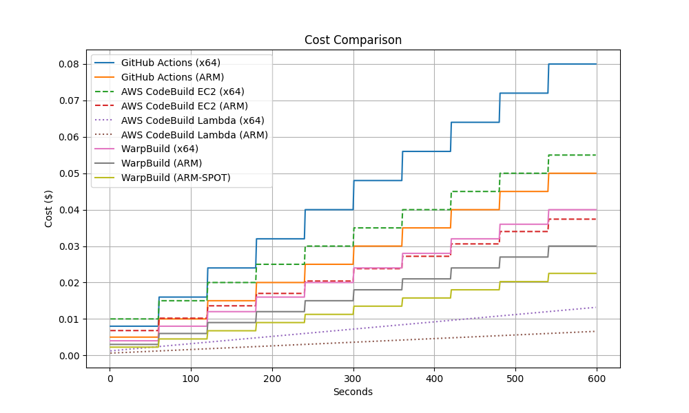
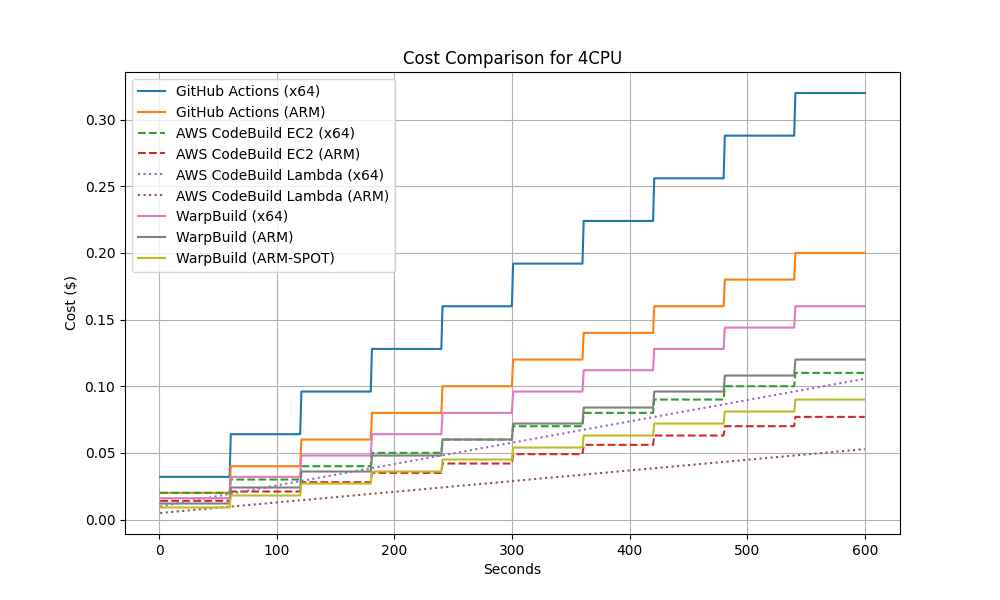

<div class="doc-header">
  <h1>GitHub ActionsのSelf-hosted RunnerをAWS CodeBuildで動かす</h1>
  <div class="doc-author">k_kojima</div>
</div>

# GitHub ActionsのSelf-hosted RunnerをAWS CodeBuildで動かす

AWS CodeBuild の User Guide [Self-hosted GitHub Actions runners in AWS CodeBuild](
https://docs.aws.amazon.com/codebuild/latest/userguide/action-runner.html) に記載がある、AWS CodeBuild を GitHub Actions の Self-hosted Runner として使用可能な機能を試します。

2024-09-20 時点での内容です。最新情報は上記ドキュメントを参照ください。
実際に使用したいとなったら自身の環境で動作確認してください。

## 基本的な使い方

AWS CodeBuild 上で GitHub に接続設定したプロジェクトを用意し、その名前を GitHub Actions の yaml の `runs-on` に記載することで動作します。

### Terraformでの作成

Terraform で表すと次のような設定です。 CodeBuild の名前は "github_runner" としています。

```terraform
resource "aws_codebuild_project" "main" {
  name               = "github_runner"
  service_role       = aws_iam_role.cb.arn
  project_visibility = "PRIVATE"
  badge_enabled      = false

  artifacts {
    type = "NO_ARTIFACTS"
  }
  source {
    buildspec           = <<-EOF
version: 0.2
phases:
  build:
    commands:
      - echo "Hello"
EOF
    git_clone_depth     = 1
    insecure_ssl        = false
    location            = "https://github.com/OWNER/REPOSITORY.git"
    report_build_status = false
    type                = "GITHUB"
    git_submodules_config {
      fetch_submodules = false
    }
  }
  environment {
    compute_type                = "BUILD_LAMBDA_2GB"
    image                       = "aws/codebuild/amazonlinux-x86_64-lambda-standard:nodejs20"
    image_pull_credentials_type = "CODEBUILD"
    type                        = "LINUX_LAMBDA_CONTAINER"
  }
  logs_config {
    cloudwatch_logs {
      status     = "ENABLED"
      group_name = aws_cloudwatch_log_group.main.id
    }
  }
}

resource "aws_codebuild_webhook" "main" {
  project_name = aws_codebuild_project.main.name
  build_type   = "BUILD"
  filter_group {
    filter {
      pattern = "WORKFLOW_JOB_QUEUED"
      type    = "EVENT"
    }
  }
}
```

Self-hosted Runner として動かすためには、 CodeBuild の Webhook で `WORKFLOW_JOB_QUEUED` のイベントを受け取るように設定します。
この設定のあるプロジェクトが、 Self-hosted Runner として認識されるようです。

コンソールからの作成では Webhook の設定を遅らせることができますが、AWS Provder 5.68.0 時点では Terraform でその設定はできません。
[API](https://docs.aws.amazon.com/codebuild/latest/APIReference/API_CreateWebhook.html#CodeBuild-CreateWebhook-request-manualCreation)側にその設定はあるため、実装される可能性はあります。

buildspec については、 Self-hosted Runner として稼働させる場合、初期設定では無視されます。そのため適当な buildspec を入れるようにしています。リポジトリ内の buildspec.yaml を使用する設定になっていても問題ありません。
コンソールから作成した場合にはリポジトリ内の buildspec.yaml を使用する設定になっているようです。
後述の設定を GitHub Actions の yaml に設定することで buildspec 内のコマンドの実行が可能です。

### コンソールでの作成

コンソールでの設定内容は次の画像のようになります。

ソースプロバイダには GitHub を指定します。


Webhook の設定は次のとおりです。
<!-- textlint-disable -->
「コードの変更がこのリポジトリにプッシュされるたびに再構築する」はチェックが必要です。
追加設定内の、「このリポジトリのウェブフックを GitHub コンソールで手動で作成します」は任意です。
<!-- textlint-enable -->
チェックを入れると Webhook を自動で作成せず、設定に必要な URL と Secret の値を作成後に表示します。
チェックなしでは AWS に設定された認証情報を使用して AWS が Webhook を作成します。


Buildspec の設定は任意です。共通して AWS 側で行いたい処理がある際に使用します。


### GitHub Actionsでの設定

上記で作成した `github_runner` の名前のプロジェクトを使用するために、 GitHub Actions の yaml に次のように記述します。

```yaml
jobs:
  build:
    runs-on: codebuild-github_runner-${{ github.run_id }}-${{ github.run_attempt }}
```

次の書き方も可能です。

```yaml
jobs:
  build:
    runs-on:
      - codebuild-github_runner-${{ github.run_id }}-${{ github.run_attempt }}
```

詳しくは[ドキュメントのUpdate your GitHub Actions workflow YAML](https://docs.aws.amazon.com/codebuild/latest/userguide/sample-github-action-runners.html#sample-github-action-runners-update-yaml)に記載があります。
`codebuild-<プロジェクト名>-${{ github.run_id }}-${{ github.run_attempt }}` のように記載すると動きます。
この記載では CodeBuild に設定されているランタイムで動作します。上の例では x64 の Node.js 20 が Lambda（2GB）上で動作します。

GitHub Actions から AWS にアクセスする際には OIDC による認証を使用することが多いですが、OIDC による接続は問題なく動作します。
次の job は OIDC の認証前と認証後でどのロールが使用されているか調べています。
1 回目の `aws sts get-caller-identity` で CodeBuild 自身のロールが表示されます。
Assume Role した後の 2 回目の呼び出しでは Assume Role した先のロールが表示されることを確認しました。
CodeBuild 実行ロールと Assume Role するロールに特別な設定は不要で、GitHub-hosted Runner で実行する時と同じように使えます。

```yaml
oidc:
  timeout-minutes: 5
  runs-on: codebuild-RUNNER-${{ github.run_id }}-${{ github.run_attempt }}
  permissions:
    id-token: write
    contents: read
  steps:
    - run: aws sts get-caller-identity # CodeBuildの実行ロールが表示される
    - uses: aws-actions/configure-aws-credentials@v4
      with:
        role-session-name: 'Session'
        aws-region: 'ap-northeast-1'
        role-to-assume: ${{ secrets.AWS_ARN }}
    - run: aws sts get-caller-identity # Assume Roleしたロールが表示される
```

## ランタイムの変更

`runs-on` に特殊な記述をすることで実行するランタイムを変更できます。

https://docs.aws.amazon.com/codebuild/latest/userguide/sample-github-action-runners-update-labels.html

### イメージの変更

CodeBuild を実行する環境を変更できます。
EC2 上で動かすか、Lambda で動かすかも変更可能です。
x64 のインスタンスか、arm64 にするかもここで選択できます。

Lambda のイメージには、一部 GitHub Actions で動作させるのが難しいイメージもあります。注意点の項目を参照してください。

設定できる内容は[こちらのドキュメントのCompute images supported with the CodeBuild-hosted GitHub Actions runner](https://docs.aws.amazon.com/codebuild/latest/userguide/sample-github-action-runners-update-yaml.images.html)に記載があります。
`image:<Environment type>-<Image identifier>` のフォーマットになります。

たとえば、EC2 の Ubuntu の CodeBuild を使用する際には次の記述をします。

```yaml
runs-on:
  - codebuild-RUNNER-${{ github.run_id }}-${{ github.run_attempt }}
  - image:ubuntu-7.0
```

Lambda の arm64 で、node20 の環境では以下を指定します。

```yaml
runs-on:
  - codebuild-RUNNER-${{ github.run_id }}-${{ github.run_attempt }}
  - image:arm-lambda-nodejs20
```

何も指定しなかった場合には CodeBuild で設定されている環境が使用されます。

#### カスタムイメージの使用

CodeBuild では EC2、Lambda ともにカスタムイメージを設定できます。
このカスタムイメージでも GitHub Self-hosted Runner を動かすことが可能です。

制約として、curl か wget がイメージ内に必須です。
`ubuntu:jammy` のようなイメージを使用してしまうと Runner のインストールができずに実行が失敗します。
`node:20` のようなイメージであれば問題ありません。
Lambda で使用する際には ECR のイメージに限定されます。
[Amazon ECR Public Gallery](https://gallery.ecr.aws/)の docker/library 配下に基本的なイメージがあるので、そこまで困ることはありません。

この場合上記のイメージの変更はできません。Webhook で次のエラーが出ます。
```json
{"message":"Invalid input: cannot use a CodeBuild curated image with imagePullCredentialsType SERVICE_ROLE"}
```
CI が起動せず、ずっと waiting の状態になります。

### インスタンスタイプの変更

CodeBuild に割り当てるスペックを変更できます。
[ドキュメントのAbout environment types](https://docs.aws.amazon.com/codebuild/latest/userguide/build-env-ref-compute-types.html#environment.types)に記載のあるスペックから使用したいものを選び、設定します。
使用できる種類や設定するパラメータについては[ドキュメントのCompute images supported with the CodeBuild-hosted GitHub Actions runner](https://docs.aws.amazon.com/codebuild/latest/userguide/sample-github-action-runners-update-yaml.images.html)に記載があります。

EC2 の arm の、もっとも小さいサイズを指定する際には次のようになります。

```yaml
runs-on:
  - codebuild-RUNNER-${{ github.run_id }}-${{ github.run_attempt }}
  - image:arm-3.0
  - instance-size:small
```

x64 の Lambda（node20）で、8GB のメモリを指定する場合には次のようになります。

```yaml
runs-on:
  - codebuild-RUNNER-${{ github.run_id }}-${{ github.run_attempt }}
  - image:linux-lambda-nodejs20
  - instance-size:8GB
```

### フリートの設定

`fleet:` を設定することで、CodeBuild を実行する fleet を指定できます。ここでの説明は省略します。

### buildspecを使用する設定

`buildspec-override:true` を設定することで buildspec のコマンドを実行できるようになります。
詳細は別の項で触れます。

使用する場合には次のような設定になります。

```yaml
runs-on:
  - codebuild-RUNNER-${{ github.run_id }}-${{ github.run_attempt }}
  - buildspec-override:true
```

### 古い書き方

2024-05 時点では次のような記述がされていました。現在も動作することは確認しましたが、"legacy"とつけられているため上記の記法を採用する方がよいと思われます。

```yaml
runs-on: codebuild-<project-name>-${{ github.run_id }}-${{ github.run_attempt }}-<environment-type>-<image-identifier>-<instance-size>
```

## Buildspecのサポート

リリース時点では Buildspec のサポートはありませんでしたが、現時点ではサポートされているようです。
次の Phase がサポートされています。

- install
- pre_build
- post_build

build ステップに関しては GitHub Actions の実行に使用されるため設定をしても動作しません。

install ステップ、pre_build でコマンドの実行に失敗すると build ステップが実行されず GitHub Actions も実行されません。

### Buildspecを使用するための設定

Buildspec を使用するためには、CodeBuild に Buildspec の内容やファイルを指定します。
コンソールでは次の画像のように設定できます。


Terraform では buildspec の設定が必須になっているのでそちらで設定できます。

今回は、CodeBuild 側で Buildspec を指定しました。

```yaml
"env":
  "variables":
    "SAMPLE_ENV_CODEBUILD": "Hey, It's CodeBuild"
"phases":
  "install":
    "commands":
      - "case $(uname -m) in aarch64) export ARCH=arm64 ;; x86_64) export ARCH=amd64
        ;; esac"
      - 'gh_url=$(curl https://api.github.com/repos/cli/cli/releases/latest | jq --arg
        file "${ARCH}.tar.gz" -r ''.assets | .[] | select(.name | endswith($file))
        | .browser_download_url'')'
      - "curl -L -o /tmp/gh.tar.gz $gh_url"
      - "mkdir /tmp/gh"
      - "tar -xvzf /tmp/gh.tar.gz -C /tmp/gh"
      - "ls -al /tmp/codebuild/bin || true"
      - "mkdir -p /tmp/codebuild/bin"
      - "ln -s /tmp/gh/**/bin/gh /tmp/codebuild/bin/gh"
  "post_build":
    "commands":
      - "echo Finished"
  "pre_build":
    "commands":
      - 'echo "Hello"'
      - "echo $PATH"
      - "node --version || true"
"version": "0.2"
```

こちらの yaml ファイルでは主に次のような動作をします。

- システムのアーキテクチャを判断し、ARCH 変数に適切な値（arm64 または amd64）を設定
- GitHub CLI の最新リリース URL を取得
- GitHub CLI をダウンロードし、解凍
- /tmp/codebuild/bin ディレクトリを作成し、その中に GitHub CLI のバイナリへのシンボリックリンクを作成

EC2 で動作する CodeBuild のイメージでは `gh` コマンドがインストールされています。
しかし Lambda で動作する CodeBuild のイメージではインストールされていないため、インストールする必要があります。

buildspec ファイルを使用するように設定すると、該当のリポジトリの buildspec ファイルが使用されます。
それによりリポジトリごとに実行内容を変更できます。
ある程度の設定は GitHub Actions の yaml で行うはずなので buildspec が必要になることは少なそうです。

### Workflow 側の設定

Buildspec を使用する場合には、 `runs-on` を適切に設定する必要があります。
[ドキュメントのRun buildspec commands the INSTALL, PRE_BUILD, and POST_BUILD phases](https://docs.aws.amazon.com/codebuild/latest/userguide/sample-github-action-runners.html#sample-github-action-runners-update-yaml)に記載があります。

```yaml
runs-on:
  - codebuild-<project-name>-${{ github.run_id }}-${{ github.run_attempt }}
  - buildspec-override:true
```

のように、 `buildspec-override:true` の追加が必要です。

詳しい指定方法は[ドキュメントのLabel overrides supported with the CodeBuild-hosted GitHub Actions runner](https://docs.aws.amazon.com/codebuild/latest/userguide/sample-github-action-runners-update-labels.html)に記載があります。
日本語版のドキュメントではまだページがありませんでした。

### 実行結果

Buildspec で実行されるコードのログは CodeBuild 側に出力されます。GitHub Actions のログには出力されません。
以下は上記の Buildspec を使用した場合のログです。最新の `gh` コマンドを取得しています。
`aws/codebuild/amazonlinux-aarch64-lambda-standard:python3.12` のイメージを使用しているので、 `node` は見つかりません。PATH に Python のパスが入っています。

```
[Container] 2024/09/20 12:51:53.178315 YAML location is /tmp/codebuild/readonly/buildspec.yml
[Container] 2024/09/20 12:51:53.178662 Processing environment variables
[Container] 2024/09/20 12:51:53.597325 Moving to directory /tmp/codebuild/output/src739/src/cd38e445_eb2c_4140_baa9_e35181f14591
[Container] 2024/09/20 12:51:53.650987 Running command case $(uname -m) in aarch64) export ARCH=arm64 ;; x86_64) export ARCH=amd64 ;; esac
[Container] 2024/09/20 12:51:53.659739 Running command gh_url=$(curl https://api.github.com/repos/cli/cli/releases/latest | jq --arg file "${ARCH}.tar.gz" -r '.assets | .[] | select(.name | endswith($file)) | .browser_download_url')
  % Total    % Received % Xferd  Average Speed   Time    Time     Time  Current
                                 Dload  Upload   Total   Spent    Left  Speed
  0     0    0     0    0     0      0      0 --:--:-- --:--:-- --:--:--     0
100 42890  100 42890    0     0   111k      0 --:--:-- --:--:-- --:--:--  111k
[Container] 2024/09/20 12:51:54.154301 Running command curl -L -o /tmp/gh.tar.gz $gh_url
  % Total    % Received % Xferd  Average Speed   Time    Time     Time  Current
                                 Dload  Upload   Total   Spent    Left  Speed
  0     0    0     0    0     0      0      0 --:--:-- --:--:-- --:--:--     0
  0     0    0     0    0     0      0      0 --:--:-- --:--:-- --:--:--     0
  0     0    0     0    0     0      0      0 --:--:-- --:--:-- --:--:--     0
100 11.5M  100 11.5M    0     0  9446k      0  0:00:01  0:00:01 --:--:-- 9446k
100 11.5M  100 11.5M    0     0  9445k      0  0:00:01  0:00:01 --:--:--     0
[Container] 2024/09/20 12:51:55.436294 Running command mkdir /tmp/gh
[Container] 2024/09/20 12:51:55.447553 Running command tar -xvzf /tmp/gh.tar.gz -C /tmp/gh
gh_2.57.0_linux_arm64/LICENSE
(略)
gh_2.57.0_linux_arm64/bin/gh
[Container] 2024/09/20 12:51:56.199001 Running command ls -al /tmp/codebuild/bin || true
ls: cannot access '/tmp/codebuild/bin': No such file or directory
[Container] 2024/09/20 12:51:56.216278 Running command mkdir -p /tmp/codebuild/bin
[Container] 2024/09/20 12:51:56.224531 Running command ln -s /tmp/gh/**/bin/gh /tmp/codebuild/bin/gh
[Container] 2024/09/20 12:51:56.302259 Running command echo "Hello"
Hello
[Container] 2024/09/20 12:51:56.309595 Running command echo $PATH
/root/.local/bin:/tmp/opt/python/site-packages/bin:/usr/local/bin:/var/lang/bin:/usr/local/bin:/usr/bin/:/bin:/opt/bin:/tmp/codebuild/bin:/codebuild/user/bin
[Container] 2024/09/20 12:51:56.316599 Running command node --version || true
/tmp/codebuild/output/tmp/script.sh: line 4: node: command not found
```

## OrganizationレベルでのWebhookの設定

リリース時点では Repository レベルでの Webhook の設定しかできませんでした。現状では Organization レベルでの Webhook の設定が可能になっています。

https://docs.aws.amazon.com/codebuild/latest/userguide/github-global-organization-webhook-events-console.html

### コンソールで設定

まずはコンソールで CodeBuild を作成します。


新しく "GitHub スコープウェブフック" が追加されています。こちらを選択すると特別な GitHub リポジトリが設定されます。


その後 Organization の設定が可能です。
CodeBuild の作成段階で Organization に Webhook が設定されるため、Webhook を設定できる GitHub アカウントでの認証が事前に必要です。

作成後、その Organization に属するリポジトリから CodeBuild での GitHub Actions の実行が可能になります。設定項目は通常とおり `runs-on` を指定します。

### Terraformでの設定

Terraform での設定は次のようになります。

```terraform
resource "aws_codebuild_project" "main" {
  name         = var.base_name
  service_role = aws_iam_role.cb.arn
  artifacts {
    type = "NO_ARTIFACTS"
  }
  environment {
    compute_type                = "BUILD_LAMBDA_1GB"
    image                       = "aws/codebuild/amazonlinux-aarch64-lambda-standard:nodejs20"
    image_pull_credentials_type = "CODEBUILD"
    type                        = "ARM_LAMBDA_CONTAINER"
  }
  source {
    buildspec       = "./buildspec.yml"
    type            = "GITHUB"
    location        = "CODEBUILD_DEFAULT_WEBHOOK_SOURCE_LOCATION"
    git_clone_depth = 1
    git_submodules_config {
      fetch_submodules = false
    }
  }
  logs_config {
    cloudwatch_logs {
      group_name = aws_cloudwatch_log_group.main.name
      status     = "ENABLED"
    }
  }
}

resource "aws_codebuild_webhook" "main" {
  project_name = aws_codebuild_project.main.name
  build_type   = "BUILD"
  filter_group {
    filter {
      pattern = "WORKFLOW_JOB_QUEUED"
      type    = "EVENT"
    }
  }
  scope_configuration {
    name  = data.github_organization.main.login
    scope = "GITHUB_ORGANIZATION"
  }
}
```

`CODEBUILD_DEFAULT_WEBHOOK_SOURCE_LOCATION` が Organization での設定をするための特別なリポジトリです。
こちらの値を `aws_codebuild_project` の `source` の `location` に指定することで、Organization 用の設定となります。

`aws_codebuild_webhook` の `scope_configuration` で Organization の指定が可能です。
この Terraform ではリポジトリのルートの Buildspec を使用しています。 `runs-on` で Buildspec を使用するようにすると Buildspec の内容に沿ったコードが実行されます。

### 備考

Webhook の Filter を設定が可能です。上記の例では必要最低限の `WORKFLOW_JOB_QUEUED` のみを設定しています。
他にもリポジトリ名の指定ができます。 `WORKFLOW_NAME` でワークフロー名の指定が可能なようです。

これにより、特定のリポジトリ/ワークフローのみを CodeBuild 上で実行できます。

## 費用

GitHub Hosted Runner との料金を比較します。
主に、Linux での実行の比較です。Windows や macOS 環境の比較はしません。
GitHub Actions, AWS CodeBuild, その他の実行環境として WarpBuild の料金を比較します。

### 参考

- GitHub Actions の料金
  - https://docs.github.com/en/billing/managing-billing-for-github-actions/about-billing-for-github-actions
  - https://docs.github.com/en/actions/using-github-hosted-runners/using-github-hosted-runners/about-github-hosted-runners#standard-github-hosted-runners-for-private-repositories
- AWS CodeBuild の料金
  - https://aws.amazon.com/jp/codebuild/pricing/
- WarpBuild の料金（比較対象）
  - https://docs.warpbuild.com/cloud-runners

### 最安コスト

マシンパワーの必要ない簡単なタスクを実行することを想定し、もっとも低いスペックでの比較です。最安で使用したい場合になります。

#### GitHub Actions

デフォルトで使用される Runner は 2CPU, 7GB メモリになります。これで$0.008/min の料金がかかります。
分単位であり、1 分未満の実行時間は切り上げされます。

ARM の Runner では$0.005/min の料金です。

#### AWS CodeBuild

`us-east-1` での料金です。`ap-northeast-1` では料金が異なるので注意してください。東京のリージョンだと EC2 の arm64 インスタンスの値段が高くなります。Lambda の価格は同じです。

- EC2
  - general1.small: 2vCPU, 3GB メモリで $0.005/min
  - arm1.small: 2vCPU, 3GB メモリで $0.0034/min
- Lambda
  - lambda.arm.1GB: 1GB メモリで $0.00001/sec（$0.0006/min）
  - lambda.x86-64.1GB: 1GB メモリで $0.00002/sec（$0.0012/min）
    - ちょうど arm64 の 2 倍

EC2 は分単位の課金（1 分未満は切り上げ）、Lambda は秒単位の課金です。
CodeBuild では runner のインストールが必要なため、GitHub に表示されている実行時間よりも長く課金されます。

#### WarpBuild

使用したことはないので、Web 上に載っている料金を使用します。

- x64（warp-Ubuntu-latest-x64-2x）: $0.004/min
- arm64（warp-Ubuntu-latest-arm64-2x）: $0.003/min
- arm64（warp-Ubuntu-latest-arm64-2x-spot）: $0.00225/min

### 比較

使用した時間に対する料金を比較します。
CodeBuild では runner のインストールに 1 分かかると想定して計算しています。実際には 30-40 秒程度で完了します。

秒に対する料金は次のグラフになります。



1 分以上の実行時には GitHub Actions の x64 がもっとも高くなります。1 分未満だと Runner の準備時間があるため EC2 の CodeBuild がもっとも高いです。
もっとも安いのは CodeBuild の Lambda の arm64 です。準備時間の課金を含めてももっとも安くなります。10 分かかっても GitHub Actions の x64 の 1 分の使用量より安くなります。

上記の結果より、軽いタスクを実行するのであれば CodeBuild の Lambda の arm64 を使用するのがもっとも安くなるとわかりました。Lambda の制限に引っかからない場合には Lambda を使用するのがお勧めです。

### 4CPUでのコスト

次に、マシンパワーを揃えて比較します。
Lambda に関してはメモリに対する指標のみが公開されているため、8GB を選択した状態での比較とします。これで 5vCPU 相当となるようです。

- GitHub Actions
  - 8CPU, 32GB メモリ
    - x64: $0.032/min
    - arm64: $0.02/min
- AWS CodeBuild
  - EC2
    - general1.medium: 4vCPU, 7GB メモリで $0.01/min
    - arm1.medium: 4vCPU, 8GB メモリで $0.007/min
  - Lambda
    - lambda.arm.8GB: 8GB メモリで $0.00008/sec（$0.0048/min）
    - lambda.x86-64.8GB: 8GB メモリで $0.00016/sec（$0.0096/min）
- WarpBuild
  - 8CPU, 32GB メモリ
    - warp-Ubuntu-latest-x64-8x: $0.016/min
    - warp-Ubuntu-latest-arm64-8x: $0.012/min
    - warp-Ubuntu-latest-arm64-8x-spot: $0.009/min



CodeBuild が安く見えますが、メモリの量が他よりも少ないことに注意してください。
この CPU の量では、Lambda の arm64 が最安になります。
メモリを多く消費するなどメモリが重要な場合は他の選択肢も検討する必要があります。

## 終わりに

AWS CodeBuild で Self-hosted Runner を使用できる機能を試しました。
とくに、前回の記事から変更された点についてみていきました。

Organization をサポートしたことで、Organizaiton 内の多数のリポジトリでの使用が容易なりました。
またリポジトリレベルでの Self hosted runner を Organization レベルで無効にしている環境でも使用しやすくなりました。
特に Lambda の料金が安いため、レビュアーの紐付けやコメントの確認などの簡単なタスクであればコストを大きく削減できます。
Buildspec もサポートされたため、共通のインストール処理などを随時行えるようになりました。
