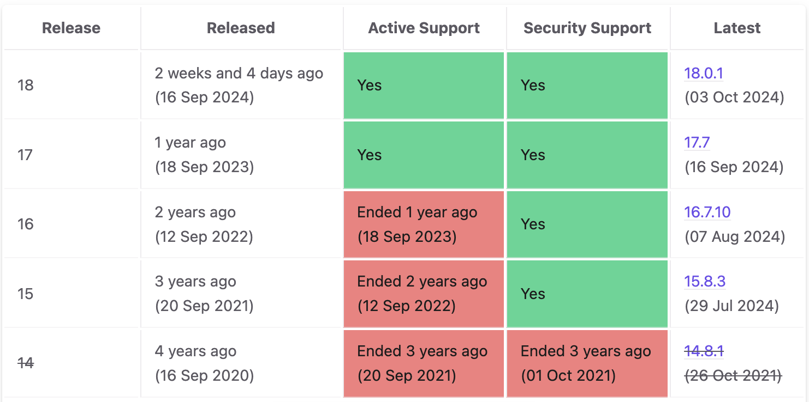
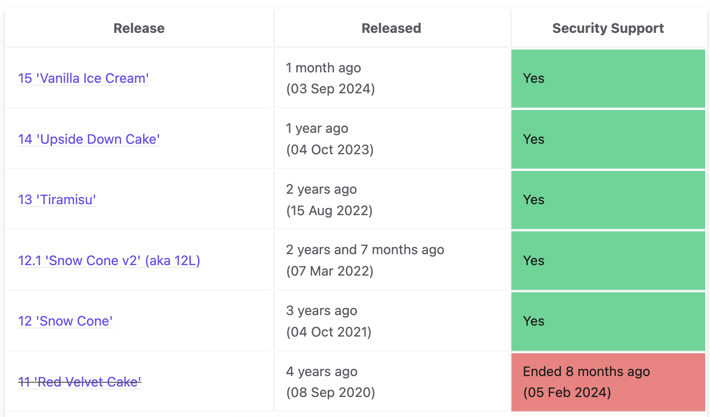
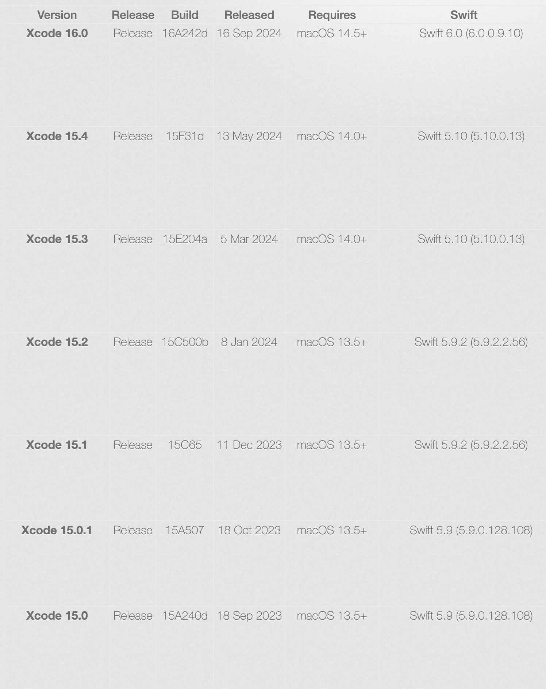
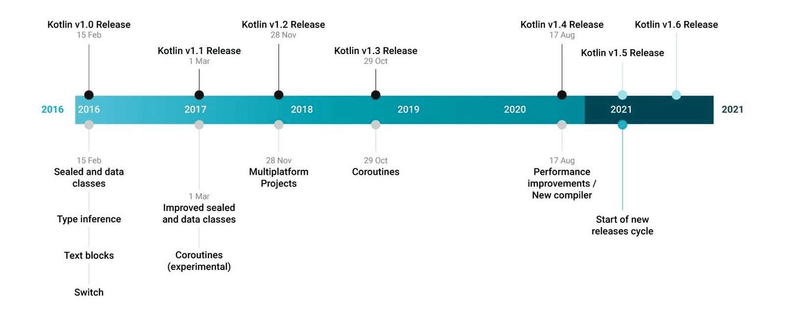
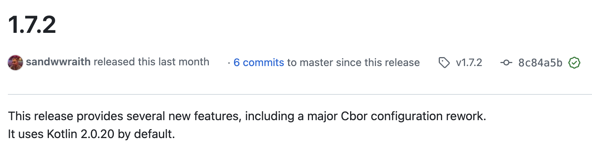
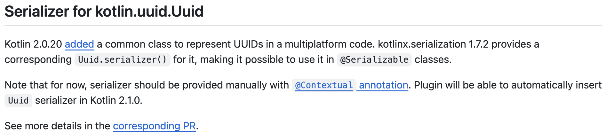
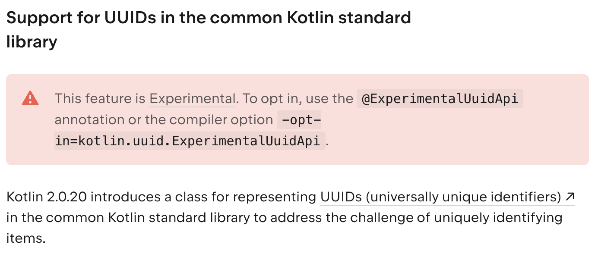

<div class="doc-header">
  <h1>依存関係とどう向き合っていくか</h1>
  <div class="doc-author">川島慶之</div>
</div>


依存関係とどう向き合っていくか
==


本記事は Zenn にも同等の内容を公開しています。出版後に加筆、修正がある場合は Zenn の記事で確認できます。Zenn ではコメントも開放しているのでフィードバックも歓迎しています。

https://zenn.dev/yumemi_inc/articles/dependency-panic

---

> プロジェクトはゆっくりと、そして容赦なく、手に負えないものとなっていくのです。ソフトウェアにおける惨事のほとんどは、たいていのプロジェクトでは気づかずに通り過ぎてしまうような、気づくには小さすぎるとも思えるものから始まるのです。[^pragmatic-programmer]

[^pragmatic-programmer]: アンドリュー・ハント／デビッド・トーマス著, 村上雅章訳. 達人プログラマーーシステム開発の職人から名匠への道ー, ピアソン, 2020, p.8

## はじめに

現代のモバイルアプリの開発は様々な要因の依存関係と向き合う必要があります。

昔のことを思い出すと今から 20年前のモバイルアプリは Java ME[^java-me] をベースに開発をしていました。アプリケーションのサイズ制限が 100KB[^100-kb] ということもあって、依存するものは極力少なくするために、 Java SDK そのものもモバイル向けに軽量にしていました。ME は Micro Edition の略称です。現在も組み込み系で、容量に制限のある環境では、 Java ME を採用しているプロダクトはありますが、モバイル環境においては、スマートフォンの登場により大きく変化し、アプリケーションのサイズ制限を気にすることなく、様々なライブラリを活用できるようになりました。

さて、こうした恩恵を受けられるようになった一方で課題となってくるのは、アプリケーションが依存するライブラリ同士の依存関係があります。一方のバージョンを上げるためには、別のライブラリのバージョンも上げる必要があり、またのその別のライブラリが依存するさらにまた別のライブラリと、依存関係の課題が連鎖することもあります。

さらにライブラリ以外にもモバイルアプリを構成する核となる OS と言語と統合開発環境も毎年大きなアップデートがあり、小さな更新は一年の間にも複数回発生します。特にライブラリは必然的に OS と言語をベースとするので、これらの変更にライブラリは影響を受けやすいです。直近の OS は大体1年周期で新しいバージョンがリリースされています。多少前後することがありますが、 OS は9月リリースが多いようです。[^eof]モバイルアプリが対応する OS は下限をサポートするほどにより多くのユーザが利用可能になる一方で、サポートのために最新 OS の機能を取り込みにくいというジレンマが発生します。

言語仕様も同様です。OS と言語は密接に関連するため、特定の OS と言語の組み合わせにも制限が生じる可能性があります。iOS アプリの開発言語である Swift は統合開発環境の Xcode にバンドルされ、これに依存しています。こちらも近年は 9月リリースになっています。[^releases-xcode]Android アプリの開発言語である Kotlin の直近のリリース 1.9.0, 2.0.0 は 5月から6月頃となっています。[^releases-kotlin-recently]それ以前のバージョンのリリース月にはばらつきがありました。[^release-kotlin-old]









[^java-me]: Java Platform, Micro Edition (Java ME) https://www.oracle.com/java/technologies/javameoverview.html
[^100-kb]: iアプリ 900i や S!アプリ V8 シリーズの頃が 100KB のサイズ制限がありました  https://ja.wikipedia.org/wiki/I%E3%82%A2%E3%83%97%E3%83%AA https://ja.wikipedia.org/wiki/S!%E3%82%A2%E3%83%97%E3%83%AA
[^eof]: End-of-life: Apple iOS https://endoflife.date/ios Android OS https://endoflife.date/android
[^releases-xcode]: Xcode Releases https://xcodereleases.com/?scope=release
[^releases-kotlin-recently]: Kotlin releases - Release details https://kotlinlang.org/docs/releases.html#release-details
[^releases-kotlin-old]: An Intellijgent bet for Kotlin. Part2 https://bell-sw.com/announcements/2020/12/04/An-intelligent-bet-for-Kotlin-part-two/

## 事例紹介

依存関係に起因して、筆者が困ったことを紹介します。
Kotlin Multiplatform でのモバイルアプリ開発における事例です。

### Case 1

kotlinx-serialization-json を 1.7.1 から 1.7.2 にアップデートとした時のことです。ビルドは通ったのですが、アプリを起動するとクラッシュしてしまいました。

iOS/Android でそれぞれ次のような実行時エラーが発生しました。

#### iOS

`kotlin.native.internal.IrLinkageError` とリンクに失敗したエラーが発生していました。

```swift
kotlin.native.internal.IrLinkageError: Reference to class 'Uuid' can not be evaluated: No class found for symbol 'kotlin.uuid/Uuid|null[0]'
```

#### Android

`Serializer` が `User` class を見つけることができませんでした。

```kotlin
kotlinx.serialization.SerializationException: Serializer for class 'User' is not found.
```

kotlinx-serialization-json は 1.7.2 から標準ライブラリの **kotlin.uuid/Uuid** に依存するようになりました。しかし、アプリ内部では依然としてサードパーティのライブラリが使用されていたため、 kotlinx-serialization-json 側で標準ライブラリのクラス解決ができなくなっていました。これが問題の原因です。

先ほどの kotlinx-serialization-json 1.7.2 のリリースノートの抜粋です。[^kotlinx-serialization-json-1-7-2]



注目すべきは **It uses Kotlin 2.0.20 by default.** です。このように依存するバージョンが default となるのは注意するキーワードとなります。さらに Kotlin 2.0.20 から導入された **kotlin.uuid/Uuid** を利用するというのも重要な変更点となりました。リリースノートのこういう部分を見逃さないようにしたいです。



Kotlin 2.0.20 で新しくなったことの紹介ページで、標準ライブラリとして UUID が導入されたことが紹介されていました。筆者は当時このリリースノートを先に目にしていたはずなのですが、ライブラリを更新する時点ではすっかり忘れていました。[^kotlin-2-0-20]



今回発生しているクラッシュは、サードパーティの UUID ライブラリから標準ライブラリの UUID に切り替えることで解決できます。ただし、発生時点では、別のサードパーティのライブラリが Kotlin 2.0.20 に未対応でした。[^skie-95]該当するライブラリは SKIE という Kotlin Multiplatform のモバイルアプリ開発において Swift から Kotlin を扱いやすくライブラリで重宝していました。

これがブロック要因となって UUID に依存するライブラリ群の更新を見合わせる判断を当時はすることになりました。[^skie-0-9-0]


この件に関しては別の記事としてまとめています。より詳細を知りたい人は記事をご覧ください。

https://zenn.dev/yumemi_inc/articles/kotlin-multiplatform-uuid

[^kotlinx-serialization-json-1-7-2]: https://github.com/Kotlin/kotlinx.serialization/releases/tag/v1.7.2
[^kotlin-2-0-20]: https://kotlinlang.org/docs/whatsnew2020.html#standard-library
[^skie-95]: touchlab / SKIE - Issues: Kotlin 2.0.20 incompatibility: NoSuchMethodError: 'org.jetbrains.kotlin.config.CompilerConfigurationKey org.jetbrains.kotlin.backend.konan.KonanConfigKeys$Companion.getBITCODE_EMBEDDING_MODE()' https://github.com/touchlab/SKIE/issues/95
[^skie-0-9-0]: 執筆時点では、 SKIE は Kotlin 2.0.20 に対応した 0.9.0 がリリースされています https://skie.touchlab.co/changelog/0.9.0

### Case 2

Xcode 16 がリリースされたので、早速利用しようと思ったところ、 Kotlin 2.0.20 が Xcode 16 に未対応のため、 Xcode 15 を利用し続ける必要がありました。[^KT-69093]
この問題は Kotlin 2.0.21-RC で対応されています。[^kotlin-2-0-21-rc]


Release Candidate でも Kotlin のバージョンを上げることができれば解消可能なのですが、ここでもサードパーティのライブラリ SKIE の Kotlin への追従が対応へのブロック要因になっています。[^skie-xcode-16]後述しますが、この問題は workaround で回避できることが確認できました。

[^KT-69093]: JetBrains YouTrack - Issues: Xcode 16 support in Kotlin https://youtrack.jetbrains.com/issue/KT-69093
[^kotlin-2-0-21-rc]: https://github.com/JetBrains/kotlin/releases/tag/v2.0.21-RC
[^skie-xcode-16]: touchlab / SKIE - Issues: Xcode 16 support https://github.com/touchlab/SKIE/issues/115

<hr class="page-break"/>

## 依存関係との向き合い方

ここまで紹介した事例のように依存関係において何か問題が起きたり、あるいはその兆候を感じた時に、どのように依存関係と向き合っていくか、筆者の取り組みを紹介します。QR コードで各 Issue へのリンクを開けるように用意したので、手元のデバイスで読み取りながら読み進めてください。

まずは、ライブラリへの依存の代替手段がないか検討します。前述の UUID のように元々言語仕様としてサポートしていなかったため、サードパーティのライブラリを利用していましたが、言語の更新により標準ライブラリが利用可能な場合は、サードパーティのライブラリから標準ライブラリに切り替える良い機会になります。

代替手段がなく、あるいは現時点では選択困難な状況であり、対象が OSS であれば、 GitHub Issues を是非とも活用したいです。 OSS ではなくバイナリだけ配布し、 Issues を活用しているライブラリもあります。

向き合い方として、次の段階があると考えています。

1. Search - Issues を確認する
2. Reply  - Issue にコメントする
3. Report - Issue を作成する
4. Fix    - Issue に対応する

Issues がオープンでなくても、あるいは併用して、 Slack など課題を共有、管理できるツールが提供されていることもあり、適宜読み替えてください。[^jetbrains-community]

[^jetbrains-community]: JetBrains が公開している参加可能な Community として、 Slack, X, Kotlin Blog, Reddit, StackOverflow, YouTube, Talking Kotlin, LinkedIn, Issue Tracker があります https://kotlinlang.org/community/

<hr class="page-break"/>

### Search - Issues を確認する

まずは既知の問題でなのか Issues を検索してみましょう。エラーメッセージや発生バージョンなどを条件に検索することで、先に他の人がレポートを上げていることがあります。ステータスを確認し、特定のバージョンですでに解決していたり、 workaround が提示されている場合もあります。

例えば、 SKIE が Kotlin 2.0.20 に対応していない Issue を探すと下記が見つかります。執筆時点では解決済みですが、 workaround として、 `0.9.0-RC.3` を利用する方法が提示されていました。

> If you could give `0.9.0-RC.3` a try and let me know if you encounter any issues I'd appreciate it!


https://github.com/touchlab/SKIE/issues/95

<hr class="page-break"/>

### Reply - Issue にコメントする

既知の問題であった場合、 Issue を読んで問題が解消した場合は、スタンプでのリアクションをおすすめします。未解決の場合は、内容を確認して、自分と同条件であれば、ここでもスタンプのリアクションをおすすめします。Issue の Description に対してのみですが、 Filters に `reactions:>=10` を含めることで、リアクションが 10以上の Issue を探すことができます。完全に状況が一致していない場合は、発生条件や結果の差異についてもコメントしてします。解析の助けや、検索性の向上に繋がります。

Koin 4.0.0 でも標準ライブラリの UUID に切り替えたことで、 kotlinx-serialization-json 1.7.2 で起きていたことと同様の問題が発生していました。そこで得た情報をコメントで共有しました。


https://github.com/InsertKoinIO/koin/issues/2003#issuecomment-2378196965

<hr class="page-break"/>

### Report - Issue を作成する

十分に検索してヒットしない場合は、未知の課題となるので Issue を作成します。このとき、自分が検索した時を思い出し、エラーメッセージや発生バージョン、付帯条件など検索性を意識して作成すると、重複した Issue の乱立を防げ、メンテナーや同様に困っている人に対しても問題を正確に伝えることができます。

またまた SKIE ですが Xcode 16 に対応していない Issue を探しても見つからなかったので、下記 Issue を作成しました。これは非常に幸運な例なのですが、メンテナーからはすぐに返信があって、 workaround を教えてもらい、問題を回避することができました。


https://github.com/touchlab/SKIE/issues/115

<hr class="page-break"/>

### Fix - Issue に対応する

Issue の内容を確認し、未解決のもので、対応可能であれば、 Pull Request を送ります。CI が用意されていることが多いので、これを積極的に活用して、安心して挑戦できる環境が用意されています。

Kable[^kable] にもサードパーティの UUID の依存があって、Kotlin 2.0.20 対応のために標準ライブラリへの切り替えが必要でした。それまで複数の関連ライブラリで標準ライブラリへの切り替えを見てきたので挑戦してみました。

実際に対応した結果、 CI でエラーが発生したのですが、 CI 上で実行しているおかげで、同じ結果を確認できるため、メンテナーから適切な助言をいただいて問題を解決するのができました。これも非常に幸運なやり取りの例です。


https://github.com/JuulLabs/kable/pull/758

[^kable]: Kotlin Asynchronous Bluetooth Low Energy provides a simple Coroutines-powered API for interacting with Bluetooth Low Energy devices. https://github.com/JuulLabs/kable

## まとめ

- リリースノートはよく読みましょう。初めて目を通したときに気づけないポイントがあるかもしれませんが、実際に試してからもう一度読み直すことで、見逃していた重要な変更点に気づくことがあります。
- 問題を報告しましょう。驚くほど早く解決に至ることがあります。特に OSS では、一つの問題を解消することで、多くの利用者やそのプロジェクトに依存している他のライブラリにまで恩恵が拡がる可能性もあります。

## おわりに

今回紹介した内容が、これから先、これを読んでいるあなたが依存関係とどう向き合っていくかの判断材料になれば嬉しいです。現代のプログラミングは変化の速度の速い領域に位置していて、どんなに丁寧に依存関係と向き合っていても、混乱の生じる場面は避けられないこともあります。そんな場面に遭遇したら機会点と捉えて、課題を共有して共に向き合っていくことでより良いサイクルを作っていきたいです。

冒頭で示したように、プラットフォーム側の更新はある程度周期化しています。これに対して、どう対応するのか正解はないと考えます。なぜなら、チームの状態やプロダクトのフェーズによって、対応可能な範囲や判断基準が異なるからです。しかし、正解がないからといってただ傍観していては容易に混乱することも経験しています。チームの状態やプロダクトのフェーズを踏まえた上で、プラットフォームの変化にどう向き合っていくのか方針を立てておくことを強く推奨したいです。
