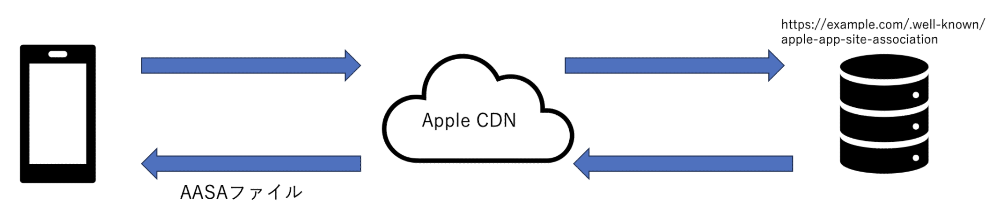

<div class="doc-header">
  <h1>Universal Links の実装方法と陥りがちな罠</h1>
  <div class="doc-author">工藤海斗</div>
</div>

# Universal Links の実装方法と陥りがちな罠

「iOS アプリと Web サイトをシームレスに繋ぐ方法はないだろうか？」と考えたことはありませんか？
ユーザー体験を向上させるために Web サイトからアプリへスムーズに誘導したい場合、Universal Links は非常に有効な手段となります。しかし、その実装には落とし穴も多く、最初の一歩でつまずくこともしばしば…。
この記事では、そんな Universal Links の基本から、実装時に注意すべきポイント、そして陥りがちな罠について詳しく解説します。

本記事で使用するドメインの例として、`example.com`を使用します。
実装する際は、`example.com`の部分をご自身で保有しているドメインに適宜差し替えてください。

## Universal Links とは

Web サイトのリンクをクリックした時に iOS アプリを起動する Apple が提供している機能のことです。
Safari または Web サイトを経由することなく、アプリ内のコンテンツに直接リンクすることができます。アプリがインストールされている場合は、ネイティブアプリに遷移し、インストールされていない場合はデフォルトの Web ブラウザでリンクを開きます。[^universal-links-overview]

[^universal-links-overview]: <https://developer.apple.com/documentation/technotes/tn3155-debugging-universal-links#Overview>

## Universal Links の仕組み

Xcode の Associated Domains で設定したドメインの apple-app-site-association(以下、AASA)が、アプリの初回ダウンロード時・アップデート時に Apple の CDN からダウンロードされることで、AASA に記載されている特定のパスからのみアプリを起動可能になります。
図にすると以下のようになります。



## Universal Links を使うための準備

Universal Links を使うためには、サーバー側とアプリ側の両方で準備作業が必要になります。
それぞれに分けて説明します。

### サーバー側の準備

1. apple-app-site-association というファイル名の JSON ファイルを用意します。このファイル名は固定です。apple-app-site-association 以外の名前にしてしまった場合は、Universal Links が正しく動作しません。
   AASA の用意は一般的に iOS エンジニアが行うと思うので、後述のアプリ側の準備で紹介します。

1. AASA を以下の URL にホストする

```
https://example.com/.well-known/apple-app-site-association
```

ファイルをサーバーに配置するときは、拡張子はつけずに格納してください。
また、AASA に対するアクセスについては、IP 制限を解除する必要があります。
理由は、Apple が管理する CDN から AASA を取得するため、外部に公開する必要があるためです。
しかし、DEV 環境や STG 環境などの開発環境は IP 制限を外したくないケースもあると思います。
IP 制限がかかっている状態で Universal Links を実現する方法は、後述のアプリ側の準備で紹介します。

### アプリ側の準備

1. Associated Domains の追加
   `applinks:<fully qualified domain>`の形式でドメインを指定します。
1. Universal Links でアプリ起動した時のハンドリング
   UniversalLinks 経由でアプリ開いた時は、AppDelegate の以下の Delegate メソッドが呼ばれるので、任意の処理をここで書きます。

```swift
func application(_ application: UIApplication, continue userActivity: NSUserActivity, restorationHandler: @escaping ([UIUserActivityRestoring]?) -> Void) -> Bool {
    guard userActivity.activityType == NSUserActivityTypeBrowsingWeb,
            let url = userActivity.webpageURL else {
        return true
    }
    // 任意の画面に遷移させるなどの処理を書く
    return true
}
```

### IP 制限がかかっていても Universal Links を有効にする方法

developer モードを有効にすることで、開発環境で Universal Links を有効にできます。
`applinks:<fully qualified domain>?mode=developer`のようにドメインの後ろに`?mode=developer`をつけることで、developer モードを有効にすることができます。

以上の工程で Universal Links を実現させることができます。
次節からは、AASA の詳しい記載方法と、AASA に記載されている URL コンポーネントのパターンマッチングについて解説します。

### AASA の記載方法

```json
{
  "applinks": {
    "details": [
      {
        "appIDs": ["ABCDE12345.com.example.app", "ABCDE12345.com.example.app2"],
        "components": [
          {
            "#": "no_universal_links",
            "exclude": true,
            "comment": "Matches any URL with a fragment that equals no_universal_links and instructs the system not to open it as a universal link."
          },
          {
            "/": "/buy/*",
            "comment": "Matches any URL with a path that starts with /buy/."
          },
          {
            "/": "/help/website/*",
            "exclude": true,
            "comment": "Matches any URL with a path that starts with /help/website/ and instructs the system not to open it as a universal link."
          },
          {
            "/": "/help/*",
            "?": { "articleNumber": "????" },
            "comment": "Matches any URL with a path that starts with /help/ and that has a query item with name 'articleNumber' and a value of exactly four characters."
          }
        ]
      }
    ]
  }
}
```

上記の AASA は[Supporting associated domains](https://developer.apple.com/documentation/xcode/supporting-associated-domains)から抜粋したものです。[^supporting-associated-domains]

[^supporting-associated-domains]: <https://developer.apple.com/documentation/xcode/supporting-associated-domains>

以下が AASA を書くまでの流れです。

1. 最上位の`applinks` を配置
   1. 他にも PasswordAutofill を実装する場合は`webcredentials` 、App Clips を実装する場合は`appclips` を指定する必要がある
2. `applinks` の配下に`details`を配列で配置
3. `appIDs`を配置し、対象の App ID を記載
   a. 対象の App ID が単一の場合は、`"appIDs": "ABCDE12345.com.example.app",` のように記載すれば良い
4. `components` 配列を配置し、`components`以下に対象にしたいパス、あるいは対象にしたくないパスなどを記載。`components` 内で URL のパターンマッチングが行われる。
   1. フラグメントは`#`
   1. パスは`/`
   1. クエリは`?`
   1. `"exclude": true` と指定した場合は、対象の URL コンポーネントを対象から除外する。デフォルトは`false` なので、対象にしたい場合は書く必要はない。
   1. `comment` では、各 URL コンポーネントの説明を記載。あくまでコメントなので、記載していなくても動作に影響はない。

### URL のパターンマッチング

ここでは、前節の AASA の`components` の中からいくつか抜粋して、どのようにパターンマッチングが行われているか見ていきましょう。

**フラグメント**

```json
"#": "no_universal_links",
"exclude": true,
```

`"no_universal_links"`というフラグメントに対して、`"exclude": true`が指定されています。

つまり、`#no_universal_links`を含む URL を Universal Links から除外します。

**パス**

```json
"/": "/buy/*",
```

パスが`buy` で始まる URL とマッチングさせます。

`*` はワイルドカードとなっており、空文字を含むどの文字列とも一致させることができます。

`https://exsample.com/buy/hoge`などの URL が対象になります。

**クエリ**

```json
"/": "/help/*",
"?": { "articleNumber": "????" },
```

まず、パスが`help` で始まる URL とマッチングさせ、直後に`articleNumber` というクエリでマッチングさせます。

`?` は任意の 1 文字との一致を表します。

`articleNumber`のクエリアイテムとして、`?` が 4 つ連なっているので任意の 4 文字で一致させることになります。

この場合では、以下の URL などが対象になります。

- `https://exsample.com/help/?articleNumber=0001`
- `https://exsample.com/help/?articleNumber=abcd`

クエリアイテムは任意の 4 文字なので、以下の URL などは対象外になります。

- `https://exsample.com/help/?articleNumber=000001`
- `https://exsample.com/help/?articleNumber=abc`

さらに詳しい記載方法は、WWDC のセッション動画でもキャッチアップすることができます。[^wwdc-2020] [^wwdc-2019]

[^wwdc-2020]: <https://developer.apple.com/videos/play/wwdc2020/10098/>
[^wwdc-2019]: <https://developer.apple.com/videos/play/wwdc2019/717/>

## Universal Links を実装するにあたってハマったポイント

### Safari のアドレスバーに直接 URL を入力しても Universal Links は機能しない

私はアドレスバーに URL を打ち込んで動作検証しており、全く Universal Links が機能しないという現象に遭遇しました。
こちらはドキュメントにガッツリ記載があり、Safari のアドレスバーに直接 URL を打っても Universal Links は動作しないよと書いてありました。（しかも日本語で！）

> Safari のアドレスバーに直接 URL を入力しても、アプリが開くことはありません。Safari では、この操作はダイレクトナビゲーションとして処理されます。ユーザーがドメインに直接移動してからそのドメインにとどまっている間は、サイトにはアプリを開くためのバナーが表示されます。[^test-universal-links-behavior]

[^test-universal-links-behavior]: <https://developer.apple.com/documentation/technotes/tn3155-debugging-universal-links#Test-universal-links-behavior>

ドキュメントはちゃんと読みましょう。。。

### 配布用証明書で配るアプリは developer モードを有効にすることができない

「developer モード」という名前がついているので、言われてみればそうだよなという感じですね。
開発用の証明書でビルドされたアプリのみ developer モードを有効にすることができます。
TestFlight 経由で配布するアプリや本番用のアプリは、IP 制限を外さないと Universal Links が機能しません。

### TestFlight で配布する場合は、すぐに AASA が端末にダウンロードされる訳ではない

AppStore 経由でダウンロードしたアプリは、ダウンロード時やアップデートに AASA も一緒にダウンロードされるのですが、TestFlight 経由に至ってはタイムラグがあるみたいです。
こちらに関しては調べてもこれと言った対策は特に見当たらないので、気長に待つしかなさそうです。
私が仕事で TestFlight 配信したアプリを確認したところ、1 時間くらいかかりました。

Developer Forums でも TestFlight 経由のアプリで Universal Links が動作しないという書き込みがあります。[^developer-forums]

[^developer-forums]: <https://forums.developer.apple.com/forums/thread/108339>

### Safari 以外がデフォルトブラウザの場合は Universal Links が機能しない可能性がある

私が手元で検証した感じだと、Safari をデフォルトブラウザにして Universal Links 起動 → その後 Safari 以外をデフォルトブラウザにして Universal Links 起動の流れだと機能しました。
しかし、最初から Safari 以外をデフォルトブラウザにしていると、特定ドメイン以外は Universal Links が機能しないように OS が制御するようです。

> Apps that have the com.apple.developer.web-browser managed entitlement may not claim to respond to Universal Links for specific domains. The system will ignore any such claims. Apps with the entitlement can still open Universal Links to other apps as usual.[^adhere-to-browser-restrictions]

[^adhere-to-browser-restrictions]: <https://developer.apple.com/documentation/xcode/preparing-your-app-to-be-the-default-browser#Adhere-to-browser-restrictions>

### 同一ドメインのブラウザ遷移だと Universal Links が機能しない

例えば、`https://example.com`という Web サイトを閲覧中に`https://example.com`を Universal Links の対象に設定しても動作しません。

> すでに Safari で閲覧している場合に Universal Links を使用してアプリを開くには、別のサブドメインを使用します。これが必要になる理由として、アンケートに回答する場合やサインインを実行する場合などがあります。Universal Links のドメインが前のナビゲーションと同じである場合、Safari では、ユーザーがブラウザでのナビゲーションを継続する意向であると推測します。[^use-universal-links-on-your-site]

[^use-universal-links-on-your-site]: <https://developer.apple.com/documentation/technotes/tn3155-debugging-universal-links#Use-universal-links-on-your-site>

では、Web サイト閲覧中にあるアクションをトリガーして Universal Links を使いたいケースではどうすれば良いのでしょうか？
実は、サブドメインを使用することで、見た目上は Web サイト閲覧中でも Universal Links を使うことができます。

**Web サイト閲覧中に Universal Links を使う方法**
前節の最後でも紹介したように、メインドメインの他にサブドメインを使用することで、Web サイト閲覧中でも Universal Links を使うことができます。
サブドメインとは、メインドメインに対して接頭語をつける形で設定されます。
例えば、メインドメインが`example.com`である場合、`sub.example.com`のように先頭に`〇〇〇.`をつけることでサブドメインを表現します。

サブドメインを設定することで異なるドメインとして扱われ、Web サイト閲覧中でも Universal Links を使うことができます。

以下に、サブドメインを使用した場合の Universal Links を使うまでの流れを記載します。
と言っても、特別難しい手順ではありません。

1. サブドメインを設定する
   1. 例えば、`example.com`がルートドメインだとしたら、`sub.example.com`などのサブドメインを設定する。サブドメインを設定することで、メインドメインとは異なるドメインとして扱われ、Universal Links を使用可能になる。
1. AASA ファイルの設定
   1. ドメインごとに適切な AASA ファイルをホスティングし、アプリに関連付ける。メインドメインとサブドメインにそれぞれ AASA ファイルを設置する必要がある。
   1. 例: `example.com/.well-known/apple-app-site-association`  と  `sub.example.com/.well-known/apple-app-site-association`  に適切な設定を配置。
1. アプリの Entitlements 設定

   1. Xcode のプロジェクト設定で、アプリの Entitlements ファイル (`.entitlements`) にメインドメインとサブドメインの両方を含むように設定する。

   ```xml
   <key>com.apple.developer.associated-domains</key>
   <array>
       <string>applinks:example.com</string>
       <string>applinks:sub.example.com</string>
   </array>
   ```

## まとめ

本記事では、Universal Links の実装方法と陥りがちな罠について紹介しました。

Universal Links の実装はユーザー体験の向上に大きく寄与しますが、正しく機能させるためにはサーバーとアプリの双方で正確な設定が必要です。AASA ファイルの準備や Xcode の設定はもちろん、細かな落とし穴も多いため、事前にしっかりと検証しながら進めることが重要です。

Universal Links を正しく実装して、アプリと Web サイトをシームレスに繋げ、ユーザーにより快適な体験を提供しましょう。

## Qiita 記事の案内

本記事は Qiita 記事を元に執筆しました。後述の URL または QR コードからアクセスしてください。加筆や修正などがある場合は Qiita 記事で対応しますのでご確認ください。また、ご質問等があれば、お気軽にコメントしてください。

```url
https://qiita.com/KaitoKudou/items/5cc3849b46e73f3a33f8
```


