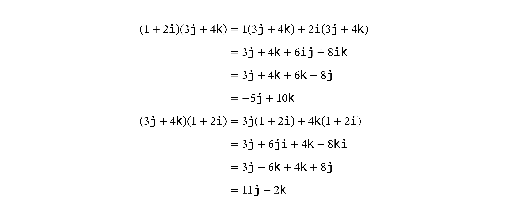
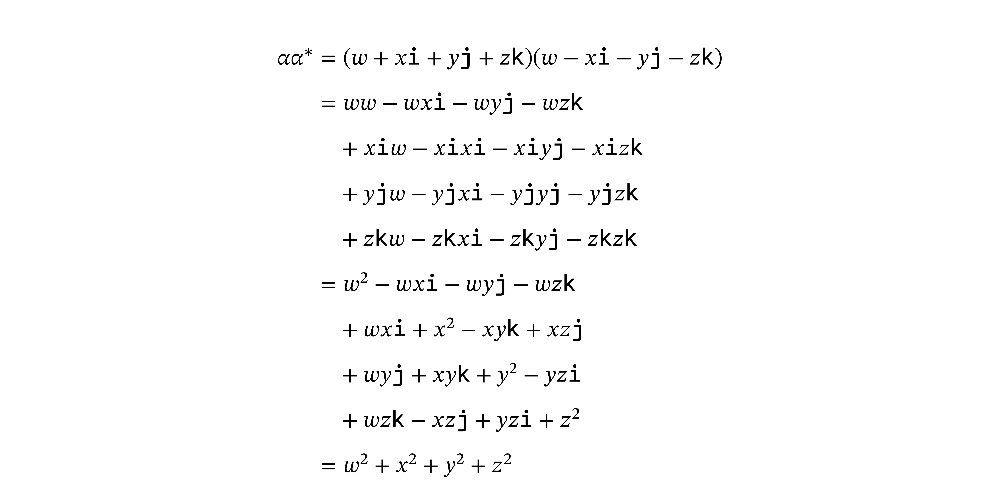
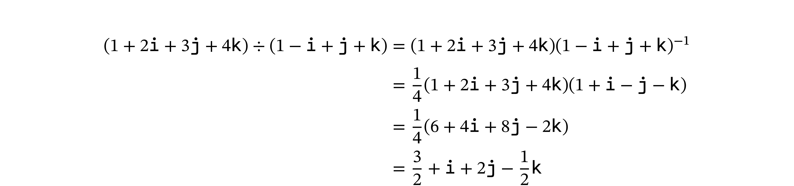
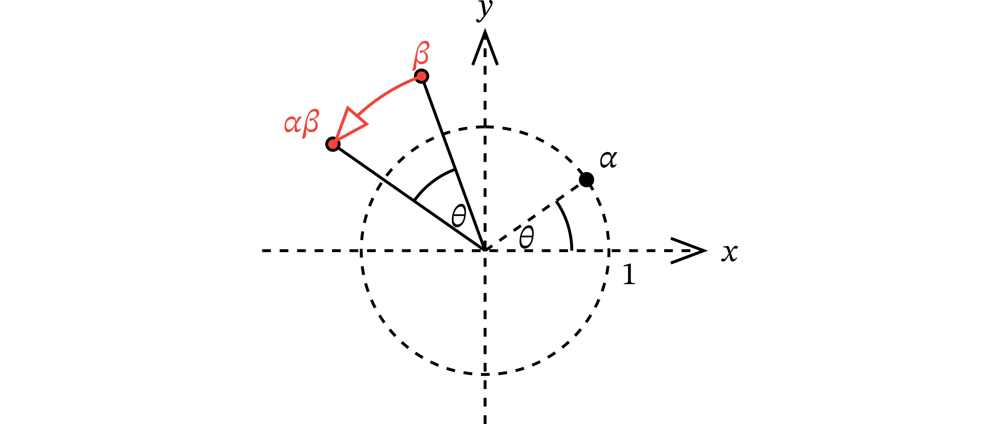
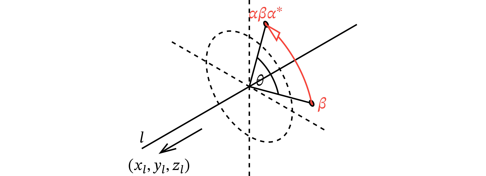
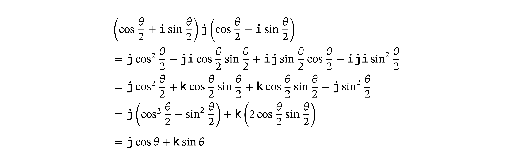

<div class="doc-header">
  <h1>Rust で学ぶクォータニオン</h1>
  <div class="doc-author">宇佐見公輔</div>
</div>

# Rust で学ぶクォータニオン

数の世界は、自然数に始まって実数、複素数と広がっていきます。この先に、さらにクォータニオンという数があります。本記事では、このクォータニオンについて基本的な事柄を解説し、Rust による計算のしかたを述べます。

なお、クォータニオンは日本語で「四元数」と呼びます。数学の世界では日本語で呼ぶことがほとんどです。ただ、コンピューターの世界では「クォータニオン」と呼ぶことが多いです。本記事もその慣習にあわせています。

## クォータニオンとは

クォータニオンとは、次の形で定義される数です。ここで、`w`、`x`、`y`、`z` は実数です。


`i`、`j`、`k` は虚数単位と呼ばれるもので、次のルールに従います。


クォータニオンはたとえば、`1 + 2i + 3j + 4k` のような数です。複素数は `1 + 2i` のような数だったので、そこに `j` と `k` という新たな虚数単位が増えたことになります。

クォータニオンの計算は、多項式の計算と同じようにおこないます。たとえば、足し算と引き算は次のようになります。`i`、`j`、`k` を変数だと思って、その係数どうしの足し算と引き算をおこなっているわけです。


## Rust の nalgebra クレート

クォータニオンを理解するための助けとして、プログラムコードでクォータニオンを扱えるようにしましょう。今回、プログラミング言語として Rust を使うことにします。Rust で線型代数を扱うクレート（ライブラリ）に nalgebra があります。このクレートにはクォータニオンを扱う機能が含まれています。

nalgebra を使うには、`Cargo.toml` に次の指定を追加します。

```toml
[dependencies]
nalgebra = "0.33.0"
```

`Quaternion` 型でクォータニオンが扱えます。

```rust
use nalgebra::geometry::Quaternion;

fn main() {
    let quaternion = Quaternion::new(1.0, 2.0, 3.0, 4.0);
    println!("{}", quaternion);
}
```

```
Quaternion 1 − (2, 3, 4)
```

個人的な好みとして、コンソール出力が数式表現に近くなるようにカスタマイズしておきます。

```rust
use nalgebra::geometry::Quaternion;

trait QuaternionDisplay {
    fn display(&self) -> String;
}

impl QuaternionDisplay for Quaternion<f64> {
    fn display(&self) -> String {
        format!(
            "{} + {} i + {} j + {} k",
            self.w, self.i, self.j, self.k
        )
    }
}

fn main() {
    let quaternion = Quaternion::new(1.0, 2.0, 3.0, 4.0);
    println!("{}", quaternion.display());
}
```

```
1 + 2 i + 3 j + 4 k
```

これを使って、先ほどの足し算と引き算の検算をおこなってみましょう。

```rust
fn main() {
    let q1 = Quaternion::new(1.0, 2.0, 1.0, 4.0);
    let q2 = Quaternion::new(5.0, 3.0, 4.0, -2.0);
    let result1 = q1 + q2;
    println!("q1 + q2 = {}", result1.display());

    let q3 = Quaternion::new(5.0, 6.0, 2.0, -3.0);
    let q4 = Quaternion::new(3.0, 2.0, 3.0, 1.0);
    let result2 = q3 - q4;
    println!("q3 - q4 = {}", result2.display());
}
```

```
q1 + q2 = 6 + 5 i + 5 j + 2 k
q3 - q4 = 2 + 4 i + -1 j + -4 k
```

## クォータニオンのかけ算

前述のように、クォータニオンの計算は多項式の計算と同様です。それはかけ算でも同じです。多項式のかけ算は、中学で習うように分配法則を使って展開しておこないます。このとき、虚数単位どうしのかけ算が発生します。これはクォータニオンの定義で述べたルールにしたがって計算します。たとえば `ij = k` などです。

ここで、注意点があります。クォータニオンはかけ算の交換法則が成り立ちません。かけ算の順番を入れ替えると計算結果が変わるのです。これは、虚数単位どうしのかけ算のルールの時点で、`ij = k`、`ji = -k` などと定義しているためです。実際に結果が変わる計算例を示します。



普通の数の計算に慣れていて「かけ算の順序は好きに入れ替えてよい」という感覚が身についてしまっている人だと、無意識に順序を入れ替えてしまうことがあります。クォータニオンのかけ算は、虚数単位の周辺では順序をきちんと意識する必要があります。

かけ算は間違えやすいですから、しっかり検算しておきましょう。

```rust
fn main() {
    let q1 = Quaternion::new(1.0, 2.0, 0.0, 0.0);
    let q2 = Quaternion::new(0.0, 0.0, 3.0, 4.0);
    let result1 = q1 * q2;
    println!("q1 * q2 = {}", result1.display());
    let result2 = q2 * q1;
    println!("q2 * q1 = {}", result2.display());
}
```

```
q1 * q2 = 0 + 0 i + -5 j + 10 k
q2 * q1 = 0 + 0 i + 11 j + -2 k
```

クォータニオンの定義がかけ算の交換法則を満たさないものになっている理由は、クォータニオンを使う動機と関係があります。後述するように、クォータニオンは 3 次元の回転を表現するための数として考案されました。このような定義にしておかないと、3 次元の回転をうまくあらわせないのです。

## 割り算についての考察

足し算、引き算、かけ算は多項式と同じでしたが、割り算はどうでしょうか。

そもそもの話として、多項式で割り算ができたでしょうか。実際のところ、考えることはできます。例として、次の割り算を考えてみます。


これは次のように、商が `x + 1` で余りは `y - 1` となります。


このように、多項式を多項式で割る計算を考えることはできますが、割り切れるとは限りません。これは、整数を整数で割る計算を考えることはできるが割り切れるとは限らない、ということと同じような話です。

整数の場合は、割り算を考えるために分数を導入しました。つまり、整数から有理数まで拡張して解決したわけです。多項式の場合も、割り算を考えるために多項式どうしの分数（有理式）を導入します。


多項式の範囲では割り算は閉じた演算になっていないのですが、有理式まで拡張した範囲では割り算は閉じた演算になります。

ここで、クォータニオンの話に戻りましょう。クォータニオンの割り算を多項式と同じように考えるとしたら、有理式を導入する必要があるのでしょうか。もしそうだとしたら、最初に述べたクォータニオンの定義と違ってきます。クォータニオンは次のような形の数として定義したのでした。


この定義を愚直に受け止めれば、`w`、`x`、`y`、`z` の部分が分数になることは許されますが、虚数単位 `i`、`j`、`k` が分母分子にくるような形は許されません。

しかし、心配はいりません。実は、クォータニオンをクォータニオンで割る計算は必ず割り切れてクォータニオンになります。有理式を持ち出す必要はないのです。これは、クォータニオンが単なる多項式とは異なるポイントです。

なぜ必ず割り切れるのかというと、実はどんなクォータニオンも逆数がクォータニオンになるためです。次のセクションでそのことを確認しましょう。

## クォータニオンの逆数

ここで、クォータニオンの共軛（きょうやく）を導入します。クォータニオン `α` の共軛とは、虚数部分の正負を反転したもののことです。


クォータニオン `α` にその共軛をかけ算してみます。手計算でやってみましょう。愚直に展開していきます。



虚数部分が打ち消しあって、きれいに消えます。個人的にこれがけっこう気持ちいいので、一度は手計算してみることをお勧めしておきます。

もちろん、プログラムで計算してもよいです。共軛は `conjugate()` で求めます。

```rust
fn main() {
    let q1 = Quaternion::new(1.0, 1.0, 2.0, 3.0);
    println!("q1 = {}", q1.display());
    let q2 = q1.conjugate();
    println!("q2 = {}", q2.display());
    let result = q1 * q2;
    println!("q1 * q2 = {}", result.display());
}
```

```
q1 = 1 + 1 i + 2 j + 3 k
q2 = 1 + -1 i + -2 j + -3 k
q1 * q2 = 15 + 0 i + 0 j + 0 k
```


もうひとつ、クォータニオンの絶対値を導入します。ノルムとも呼びます。


ノルムを二乗して平方根をはずした形もよく使います。実は、先ほど共軛とのかけ算で出てきた値が、ちょうどノルムの二乗と等しいです。

ノルムは `norm()` で、ノルムの二乗は `norm_squared()` で求めます。

```rust
fn main() {
    let q1 = Quaternion::new(1.0, 1.0, 2.0, 3.0);
    println!("q1 = {}", q1.display());
    let result1 = q1.norm();
    println!("|q1| = {}", result1);
    let result2 = q1.norm_squared();
    println!("|q1|^2 = {}", result2);
}
```

```
q1 = 1 + 1 i + 2 j + 3 k
|q1| = 3.872983346207417
|q1|^2 = 15
```

共軛とノルムを使うと、次の式が成り立ちます。


クォータニオン `α` が与えられたとき、この式のカッコの中の値をかけると `1` になることがわかります。これはつまり、このカッコの中の値が `α` の逆数であるということです。

こうして、どんなクォータニオンも逆数がクォータニオンで書けることがわかりました。なお、ここまで何度か「どんなクォータニオンも」と書いてきましたが、ゼロだけは例外です。ゼロは逆数を持ちません。ゼロで割ることもできません。

クォータニオンの逆数もプログラムで計算してみましょう。逆数は `try_inverse()` で求めます。これは `Optional` な値を返します。なぜなら、ゼロは逆数を持たないからです。ゼロ以外であれば逆数を持ちますので、問題なく `unwrap()` 可能です。

```rust
fn main() {
    let q1 = Quaternion::new(1.0, 1.0, 2.0, 3.0);
    println!("q1 = {}", q1.display());
    let q2 = q1.try_inverse().unwrap();
    println!("q2 = {}", q2.display());
    let result = q1 * q2;
    println!("q1 * q2 = {}", result.display());
}
```

```
q1 = 1 + 1 i + 2 j + 3 k
q2 = 0.06666666666666667 + -0.06666666666666667 i + -0.13333333333333333 j + -0.2 k
q1 * q2 = 1 + 0 i + 0 j + -0.000000000000000027755575615628914 k
```

計算誤差が出てきてしまって、かけ算の結果がちょうど `1` にはなっていません。しかし、ちゃんと逆数であろうことは見てとれます。

## クォータニオンの割り算

では、割り算の話に戻りましょう。クォータニオンの割り算は「逆数をとってかけ算する」という計算になります。手計算でやってみましょう。かけ算の計算は展開して 16 個の項が出てきますが、ここではその途中の式は省略しています。



プログラムで検算します。クォータニオンの割り算は nalgebra では直接定義されていません。そのため、`try_inverse()` で逆数をとって `*` でかけ算することになります。

```rust
fn main() {
    let q1 = Quaternion::new(1.0, 2.0, 3.0, 4.0);
    let q2 = Quaternion::new(1.0, -1.0, 1.0, 1.0);
    let result = q1 * q2.try_inverse().unwrap();
    println!("q1 / q2 = {}", result.display());
}
```

```
q1 / q2 = 1.5 + 1 i + 2 j + -0.5 k
```

こうして、クォータニオンは加減乗除の四則演算がひととおりできることを見ました。このように、かけ算の交換法則を除いて四則演算ができる代数構造は、数学では斜体と呼ばれています。

## クォータニオンと 3 次元回転

クォータニオンで 3 次元回転が記述できることを見てみます。まず、2 次元平面内の回転は複素数で記述できます。

- 点をあらわす複素数：平面上の点 `(x,y)` を、複素数 `x + yi` であらわす。
- 回転をあらわす複素数：原点を中心とする角度 `θ` の回転を、絶対値 `1` で偏角 `θ` の複素数 `cosθ + i sinθ` であらわす。

点 `β` を回転 `α` で回転させた点は、複素数をかけ算した `αβ` であらわされる点になります。言い換えると、点 `(x,y)` を原点を中心として角度 `θ` 回転させた点は、複素数 `(cosθ + i sinθ)(x + yi)` であらわされる点になります。



同じように、3 次元空間内の回転ではクォータニオンで記述できます。実のところ、クォータニオンはこのために考案された数です。

- 点をあらわすクォータニオン：空間上の点 `(x,y,z)` を、クォータニオン `xi + yj + zk` であらわす。
- 回転をあらわすクォータニオン：原点をとおる直線 `l` のまわりの角度 `θ` の回転を、次のノルム `1` のクォータニオンであらわす。


ただし、`(xl,yl,zl)` は直線 `l` の単位方向ベクトルです。

点 `β` を回転 `α` で回転させた点は、クォータニオンのかけ算であらわせます。ここで共軛を使っています。回転をあらわすクォータニオンはノルム `1` なので、共軛は逆数でもあります。



## 回転の計算

具体例をひとつ見ます。

- 点 `(0,1,0)`
- `x` 軸のまわりの `45` 度の回転

`x` 軸の単位方向ベクトルは `(1,0,0)` ですから、`x` 軸のまわりの `θ` 度回転をあらわすクォータニオンは次のとおりです。


点 `(0,1,0)` をあらわすクォータニオンは `j` です。この点を `x` 軸のまわりに `θ` 度回転した点は次のように書けることになります。


では、これを計算してみましょう。愚直に展開して虚数単位のルールにしたがいます。



最後の行では、三角関数の倍角の公式を使いました。

この結果の `θ` に `45` 度を代入すると、回転した結果の座標がわかります。


次に、同じ回転をプログラムで計算してみます。回転をあらわすクォータニオンを生成するには `UnitQuaternion` 型の `from_axis_angle()` が便利です。回転軸の方向ベクトルと回転角を指定して生成できます。

```rust
fn main() {
    // x軸のまわりの45度回転をあらわすクォータニオン
    let alpha = UnitQuaternion::from_axis_angle(
        &Vector3::x_axis(),
        45.0 * std::f64::consts::PI / 180.0,
    );
    println!("alpha = {}", alpha.display());
    // 3次元空間の点
    let beta = Point3::new(0.0, 1.0, 0.0);
    println!("beta = {}", beta);
    // 3次元空間の点を回転させる
    let result = alpha.transform_point(&beta);
    println!("result = {}", result);
}
```

```
alpha = 0.9238795325112867 + 0.3826834323650898 i + 0 j + 0 k
beta = {0, 1, 0}
result = {0, 0.7071067811865475, 0.7071067811865476}
```

`transform_point()` で 3 次元回転の計算をしてくれます。この計算は、自分でクォータニオンのかけ算をしても同じ結果が得られます。確認してみましょう。

```rust
fn main() {
    // x軸のまわりの45度回転をあらわすクォータニオン
    let alpha_unit = UnitQuaternion::from_axis_angle(
        &Vector3::x_axis(),
        45.0 * std::f64::consts::PI / 180.0,
    );
    let alpha = alpha_unit.into_inner();
    println!("alpha = {}", alpha.display());
    // 3次元空間の点をあらわすクォータニオン
    let beta = Quaternion::from_imag(Vector3::new(0.0, 1.0, 0.0));
    println!("beta = {}", beta.display());
    // 3次元空間の点を回転させる
    let result = alpha * beta * alpha.conjugate();
    println!("result = {}", result.display());
}
```

```
alpha = 0.9238795325112867 + 0.3826834323650898 i + 0 j + 0 k
beta = 0 + 0 i + 1 j + 0 k
result = 0 + 0 i + 0.7071067811865475 j + 0.7071067811865476 k
```

## おわりに

本記事では、クォータニオンについて基本的な事柄を解説し、Rust による計算のしかたを述べました。

クォータニオンで 3 次元回転が記述できることにも触れました。3 次元回転は、一般的にはベクトルと行列を使って線型代数の手法で扱うことが多いです。しかし、クォータニオンは行列に比べていくつか利点があります。その利点のひとつが、回転の補間が容易であることです。

nalgebra クレートの `UnitQuaternion` 型にも、補間計算のための `slerp()` などがあります。これを利用して、3 次元回転の中間状態を計算でき、回転をなめらかに見せることも可能になります。

興味が出てきたら、ぜひさらに勉強してみてください。

## 参考文献

入門のための書籍をいくつか挙げておきます。

- 矢野忠、四元数の発見、海鳴社、2014
- 金谷一朗、3D-CG プログラマーのためのクォータニオン入門、工学社、2022
- 今野紀雄、四元数、森北出版、2016

また、nalgebra クレートのリファレンスは次のところにあります。

- `https://docs.rs/nalgebra/`

<!-- 奇数ページを調整するための強制改ページ -->
<!-- markdownlint-disable -->
<hr class="page-break" />
　
<!-- markdownlint-enable -->
