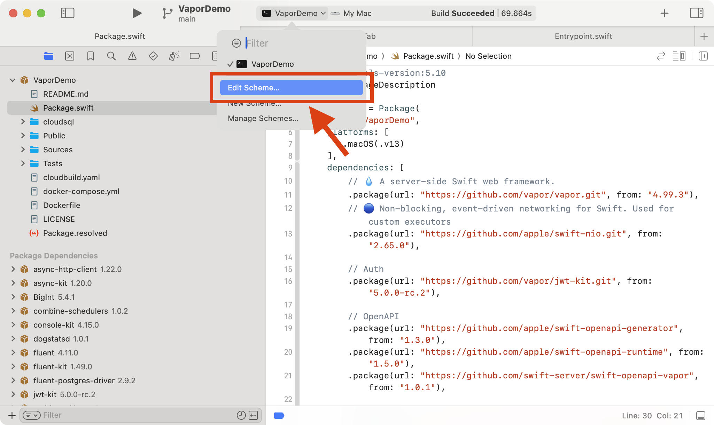
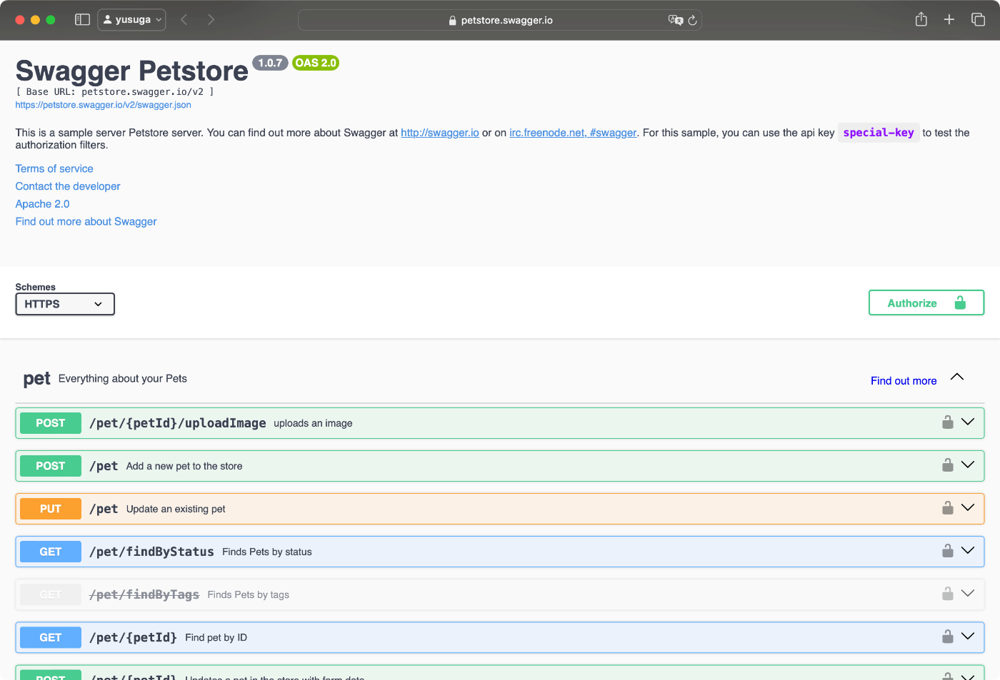

<div class="doc-header">
  <h1>Server Side Swift - API サーバ構築</h1>
  <div class="doc-author">菅原 祐</div>
</div>

Server Side Swift - API サーバ構築
==

本稿は Zenn でも読むことができます。加筆や修正などがある場合は Zenn の記事で対応します。


## Server Side Swift とは

[Swift on Server](https://www.swift.org/documentation/server/) の内容を引用します。


### 1. 概要

Swift は Apple によって開発された汎用プログラミング言語で、元々は iOS や macOS, watchOS, tvOS 向けのアプリケーション開発のために設計されました。しかし、Swift はシステムプログラミングからモバイル、デスクトップアプリケーション、そして分散型のクラウドサービスに至るまで、幅広い用途に対応できるよう設計されています。特に Swift は、開発者が正確なプログラムを書くことを容易にするように設計されています。

Swift on Server は、Swift 言語をサーバーサイド開発に使用する能力を指します。サーバー上で Swift アプリケーションを展開するためには、Vapor や Hummingbird のような Web フレームワークが利用されます。これらのフレームワークは、ルーティング、データベース統合、リクエスト処理などの重要な機能を提供し、開発者がビジネスロジックの構築に集中できるようサポートします。

### 2. なぜ Swift をサーバーで使うのか

Swift on Server には、サーバーサイドコードを記述するためのモダンで安全かつ効率的な選択肢を提供します。Swift は、ハイレベル言語のシンプルさと読みやすさ、そしてコンパイル言語の性能と安全性を兼ね備えており、開発者は Swift を使用してエンドツーエンドのソリューションを構築できます。

### 3. パフォーマンス

Swift は高速な性能と低いメモリ消費を提供します。自動参照カウント（ARC）を使用してリソースを正確に管理するため、トレースガベージコレクションを行う他の言語と比較して、リソースの利用効率が高くなります。この特性により、Swift はクラウドサービスの分野で強みを発揮します。

### 4. 高速な起動時間

<!-- textlint-disable -->
Swift ベースのアプリケーションは、ほとんどウォームアップ操作を必要としないため、迅速に起動します。このため、Google Cloud Functions や AWS Lambda などのサーバーレスアプリケーションでも優れた適合性を持ち、特に「コールドスタート」時間がほとんどないというメリットがあります。
<!-- textlint-enable -->

### 5. 表現力と安全性

Swift は、型の安全性やオプショナル、メモリの安全性を強制する機能を持っており、プログラミングエラーを防ぎ、コードの信頼性を向上させます。Swift の並行処理モデルはスケーラブルで応答性の高いサーバーアプリケーションの開発に適しています。

### 6. サポートされたエコシステム

Swift のエコシステムには、サーバーサイド開発に特化した多くのライブラリやツールが含まれています。これにより、Swift を使用して高速でスケーラブル、かつセキュアなバックエンドサービスを構築する新たな可能性が広がります。

### 7. 開発ガイドと Swift Server Workgroup

Swift Server Workgroup は、Swift を使ったサーバーアプリケーションの開発と展開を推進するための指導チームです。このワークグループは、Swift サーバーコミュニティのニーズに応えるための取り組みを定義し、優先順位を付けています。

これらの特性により、Swift on Server は現代のクラウドプラットフォームでのリソース効率を最大化するための優れた選択肢となります。

### 開発方法

[Swift](https://github.com/swiftlang/swift) 言語は Linux をサポートしています。つまり、Linux 上でのコンパイル、実行、開発が可能であり、Linux で動作するサーバーサイドアプリケーションやコマンドラインツールを生成できます。

<!-- textlint-disable -->
Server Side Swift で API サーバーを開発する場合、一般的には Linux 上で API サーバーとして動作する実行可能ファイルを生成することを指します。これには、Vapor などのフレームワークを使用して API エンドポイントを構築し、データベースとの連携やリクエスト処理など、サーバーサイドの全体的なロジックを実装することが含まれます。また、Linux をサポートしているため、Docker コンテナ上で動作させることも可能です。
<!-- textlint-enable -->

<!-- textlint-disable -->
IDE は iOS 開発と同様に Xcode を使うことも可能ですが、Server Side Swift は Xcode に依存していないため [swiftlang/vscode-swift](https://github.com/swiftlang/vscode-swift) を利用することで VS Code での開発も可能です。
<!-- textlint-enable -->

### 実行方法

#### ローカル環境

Xcode で Run するとローカルに API サーバが起動するので、 http://localhost:8080 に対してリクエストするとレスポンスが返ってきます。Xcode のデバッガも動いているので、通常の iOS 開発と同様にブレークポイントで止めたり、po などの LLDB のデバッガコマンドも利用可能です。

#### クラウド環境

ひとつの方法として、API サーバの実行可能ファイルを含む Docker イメージ（OS、環境設定、依存ライブラリ、アプリケーションの実行可能ファイルなど）を作成します。その Docker イメージを使用して AWS Fargate や GCP の Cloud Run 上で Docker コンテナを起動し、アプリケーションを実行します。

## 2024年時点での Server Side Swift の最新トレンドを確認

<!-- textlint-disable -->swift.org<!-- textlint-enable --> がお勧めしているライブラリ一覧から現時点のトレンドを確認してみます。


### サーバーサイドフレームワーク

| <div class="no-break">ライブラリ</div> | <div class="no-break">GitHub Star</div> | <div class="no-break">最終リリース日</div> | 特徴 |
| --- | ---: | --- | --- |
| [Vapor](https://github.com/vapor/vapor) | 24,300 | 2024-08-22 | Server Side Swift の代表的なフレームワークで、豊富な機能とエコシステムを持ち、大規模なアプリケーションから小規模な API まで幅広く対応している。[日本語ドキュメント](https://docs.vapor.codes/ja/)あり<br>読み方: ゔぇいぱー or べーぱー |
| [Perfect](https://github.com/PerfectlySoft/Perfect) | 13,800 | 2016-03-22 | 開発終了<!-- textlint-disable -->？<!-- textlint-enable --> |
| [Kitura](https://github.com/Kitura/Kitura) | 7,600 | 2022-09-18 | IBM が開発していたが2020年に IBM による開発は終了し、その後は OSS としてメンテされている |
| [Smoke](https://github.com/amzn/smoke-framework) | 1,400 | 2024-07-19 | Amazon Prime Video で使用されている（[らしい](https://x.com/kateinoigakukun/status/1306520182668492801)） |
| [Hummingbird](https://github.com/hummingbird-project/hummingbird) | 1,100 | 2024-08-27 | シンプルかつ軽量な設計が特徴で、最小限の依存関係で API を構築可能で拡張性が高く、小規模なサービスやプロトタイプの開発に向いている |

### 関連ライブラリ

| OSS | 説明 |
| --- | --- |
| [apple/SwiftNIO](https://github.com/apple/swift-nio) | 非同期イベント駆動型のネットワークライブラリで、非同期かつノンブロッキングな I/O もサポート<br>Vapor も依存している基盤技術 |
| [apple/swift-openapi-generator](https://github.com/apple/swift-openapi-generator) | OpenAPI の定義から Swift コードを生成 |
| [swift-server/swift-openapi-vapor](https://github.com/swift-server/swift-openapi-vapor) | <!-- textlint-disable -->swift-openapi-generator<!-- textlint-enable --> が生成したコードを Vapor に組み込むための実装を提供 |
| [vapor/Fluent](https://github.com/vapor/fluent) | PostgreSQL, MySQL などをサポートしている <!-- textlint-disable -->ORM<!-- textlint-enable --> |
| [vapor/JWTKit](https://github.com/vapor/jwt-kit) | 型安全な JWT |
| [vapor/MultipartKit](https://github.com/vapor/multipart-kit) | 型安全な multipart-encoded data |
| [apple/Swift Crypto](https://github.com/apple/swift-crypto/) | 一般的な暗号操作 |
| [vapor/PostgresNIO](https://github.com/vapor/postgres-nio) | Swift-NIO をベースにした非同期の PostgreSQL クライアント |
| [swift-server/RediStack](https://github.com/swift-server/RediStack) | Swift-NIO をベースにした [Redis](https://redis.io/)（インメモリデータベース）クライアント |

### 結論: Vapor を採用

Vapor は最初期から開発されていたライブラリで、修正ツールも豊富にあります。2024 年時点においても Vapor が最有力候補となりそうです。本稿においては Vapor を採用して Server Side Swift の開発を進めていきます。

<hr class="page-break"/>

## <!-- textlint-disable -->動作確認環境<!-- textlint-enable -->

- Xcode 16.0
- Vapor 4.99.3

## サンプルプロジェクト

完成したプロジェクトはこちらです。


## macOS で API サーバを起動する

API サーバは最終的に Linux 上の Docker コンテナで構築しますが、まずは macOS で構築を試してみます。

### Vapor をインストール

```sh
$ brew install vapor
```

インストールが成功したかどうかを `--version` で確認します。

```sh
$ vapor --version
note: no Package.resolved file was found. Possibly not currently in a Swift package directory
framework: Vapor framework for this project: no Package.resolved file found. Please ensure you are in a Vapor project directory. If you are, ensure you have built the project with `swift build`. You can create a new project with `vapor new MyProject`
toolbox: 18.7.5
```

### Vapor のテンプレートからプロジェクトを作成

`vapor new VaporDemo -n` を実行して、Vapor プロジェクトを作成します。`-n` をつけることですべての質問が `NO` になり、最小限の構成で作成できます。

```sh
$ vapor new VaporDemo -n
Cloning template...
name: VaporDemo
Would you like to use Fluent (ORM)? (--fluent/--no-fluent)
y/n> no
fluent: No
Would you like to use Leaf (templating)? (--leaf/--no-leaf)
y/n> no
leaf: No
Generating project files
+ Package.swift
+ entrypoint.swift
+ configure.swift
+ routes.swift
+ .gitkeep
+ AppTests.swift
+ .gitkeep
+ Dockerfile
+ docker-compose.yml
+ .gitignore
+ .dockerignore
Creating git repository
Adding first commit
```

### API サーバを起動

テンプレートから作成したプロジェクト内にある <!-- textlint-disable -->Package.swift<!-- textlint-enable --> を Xcode で開きます。

```sh
$ cd VaporDemo
$ open Package.swift
```

Xcode で Target を `My Mac` にして Run すると、コンソールに次のログが表示されます。

> [ INFO ] Server starting on http://127.0.0.1:8080

ブラウザで http://127.0.0.1:8080 を開きます。`It works!` と表示されればサーバの起動に成功しています。


## API サーバを開発

### ルーティング

デフォルトのルーティングのコードは `Sources/App/routes.swift` に定義されています。http://127.0.0.1:8080 にアクセスすると `It works!` と表示されているのも、routes メソッドが実装されているからです。

```swift
func routes(_ app: Application) throws {
  app.get { req async in
    "It works!"
  }

  app.get("hello") { req async -> String in
    "Hello, world!"
  }
}
```

試しに http://127.0.0.1:8080/hello にアクセスすると `Hello, world!` が表示されるのが確認できます。

**注意**

ブラウザによっては http://127.0.0.1:8080 を開く際に意図せず http://www.127.0.0.1:8080 のように www が追加されてしまい API に正常にアクセスできないことがあります。ブラウザで動作確認する際には www がついていないことにも注意してください。たまに発生して何回も悩みました…。

### 公開ファイルへのアクセス

#### 画像ファイルを追加

表示したい画像を Public ディレクトリ内に追加します（仮に sample.jpg とします）。

`Sources/App/configure.swift` の `configure(_:)` 関数に FileMiddleware を追加します。

```swift
public func configure(_ app: Application) async throws {
  // Serves files from `Public/` directory
  app.middleware.use(
    FileMiddleware(
      publicDirectory: app.directory.publicDirectory
    )
  )

  // register routes
  try routes(app)
}
```

#### [重要] Xcode の Working directory を変更

Xcode で開発する場合には Scheme から `Working directory`（作業ディレクトリ）をプロジェクトのルートディレクトリに変更する必要があります。

Xcode のデフォルトの `Working directory` は DerivedData になります。このディレクトリはプロジェクトのルートディレクトリとは異なるため、 Public ディレクトリが存在しません。API サーバを起動した後のコンソールのログにも次の WARNING が表示されることが確認できます。

> [ WARNING ] No custom working directory set for this scheme, using /Users/yusuga/Library/Developer/Xcode/DerivedData/VaporDemo-bydmlsxjelhsszfvkumwycmxbtzn/Build/Products/Debug




ブラウザで http://127.0.0.1:8080/sample.jpg にアクセスすると画像が表示されることを確認できます。

### 画像を返す

すでに Public ディレクトリに sample.jpg を置いているので http://127.0.0.1:8080/sample.jpg でアクセス可能ですが、 http://127.0.0.1:8080/image にアクセスした時にも画像が返るようにしてみます。

`routes(_:)` 関数に新たなエンドポイントを追加します。

```swift
func routes(_ app: Application) throws {

  // <中略>

  app.get("image") { request async throws in
    // public ディレクトリ内にある画像へのパスを取得
    let path = app.directory.publicDirectory.appending("sample.jpg")

    // 指定したパスの ByteBuffer を取得
    let buffer = try await request.fileio.collectFile(at: path)

    var headers = HTTPHeaders()
    headers.contentType = .jpeg

    return Response(
      status: .ok,
      headers: headers,
      body: .init(buffer: buffer)
    )
  }
}
```

http://127.0.0.1:8080/image にアクセスすると画像が表示されることを確認できます。

### JSON を返す

JSON を返すエンドポイントを追加します。

```swift
func routes(_ app: Application) throws {

  // <中略>

  app.get("json") { _ in
    let json = [
      "message": "Hello, Vapor!",
      "status": "success"
    ]
    let response = Response(status: .ok)
    try response.content.encode(json, as: .json)
    return response
  }
}
```

ブラウザでも確認可能ですが、今回は curl コマンドで動作確認を行ってみます。

curl コマンドは、さまざまな通信プロトコルでデータの送受信を行うことができるコマンドで、macOS にはプリインストールされているため、追加インストール不要でそのままコンソールで使用可能です。

`-v` をオプションをつけるとリクエストとレスポンスの詳細情報が表示されます。

```sh
$ curl -v http://127.0.0.1:8080/json
*   Trying 127.0.0.1:8080...
* Connected to 127.0.0.1 (127.0.0.1) port 8080
> GET /json HTTP/1.1
> Host: 127.0.0.1:8080
> User-Agent: curl/8.6.0
> Accept: */*
>
< HTTP/1.1 200 OK
< content-type: application/json; charset=utf-8
< content-length: 46
< connection: keep-alive
< date: Thu, 26 Sep 2024 19:39:00 GMT
<
* Connection #0 to host 127.0.0.1 left intact
{"message":"Hello, Vapor!","status":"success"}%
```

### EventLoopFuture vs async/await

<!-- textlint-disable -->
Vapor 4 では、各メソッドに EventLoopFuture を返すものと、async/await に対応したものの 2 種類が定義されています。EventLoopFuture は、async/await が導入される以前の非同期処理の手法です。現在、多くの Vapor のメソッドは async/await に対応しており、どちらを使用するかは開発者が選択可能です。
<!-- textlint-enable -->

async/await の方がコードの可読性が高い一方で、EventLoopFuture ではイベントループ（非同期タスクを処理するスレッドやキュー）を直接操作できるという利点があります。これにより、タスクの処理やスケジューリングをより細かく制御できるため、細かな調整が必要な場面では EventLoopFuture の方が優れています。

<!-- textlint-disable -->
ただし、Swift 5.9 で導入された [SE-0392: Custom Actor Executors](https://github.com/swiftlang/swift-evolution/blob/main/proposals/0392-custom-actor-executors.md) により、async/await でも同様の細かな制御が可能となったため、現在は async/await を優先的に使用しても問題ありません。

さらに、Vapor 5 では EventLoopFuture は削除される予定であるため、将来を見据えても async/await を使用することが推奨されます。

### Controller の活用

URI を階層的に構造化する場合にはパスセグメントを使用します。URI のパスセグメントは、リソースの階層的な場所を指定する部分です。スラッシュで区切られた各部分が階層を表し、サーバー上の特定のリソースへアクセスするために使われます。

ここまでで実装した image と json を http://127.0.0.1:8080/my 以下からもアクセスできるようにするため、新たに <!-- textlint-disable -->MyController.swift<!-- textlint-enable --> を定義します。

```swift
import Vapor

struct MyController: RouteCollection {

  func boot(routes: RoutesBuilder) throws {
    // パスセグメントを定義
    let myRoutes = routes.grouped("my")

    // パスと処理を行うメソッドを登録
    myRoutes.get("image", use: getImage)
    myRoutes.get("json", use: getJSON)
  }

  @Sendable
  func getImage(request: Request) async throws -> Response {
    // Public ディレクトリ内にある画像へのパスを取得
    // ※ routes.swift からの差分で app へのアクセスが request.application に変わります
    let path = request.application.directory.publicDirectory.appending("sample.jpg")

    // 指定したパスの ByteBuffer を取得
    let buffer = try await request.fileio.collectFile(at: path)

    var headers = HTTPHeaders()
    headers.contentType = .jpeg

    return Response(
      status: .ok,
      headers: headers,
      body: .init(buffer: buffer)
    )
  }

  @Sendable
  func getJSON(request: Request) throws -> Response {
    let json = [
      "message": "Hello, Vapor!",
      "status": "success"
    ]
    let response = Response(status: .ok)
    try response.content.encode(json, as: .json)
    return response
  }
}
```

`routes(_:)` 関数にコントローラの登録を追加します。

```swift
func routes(_ app: Application) throws {
  // <中略>
  try app.register(collection: MyController())
}
```

これで http://127.0.0.1:8080/my/json と http://127.0.0.1:8080/my/image にアクセスが可能になります。

### カスタムしたエラーを返す

画像を取得するために使用していた `request.fileio.collectFile(at:)` は存在しないリソースにアクセスするとエラーを throw します。

どんなエラーを throw するかを確認するために MyController へ新しいエンドポイントで `notfound-500` を追加します。

```swift
struct MyController: RouteCollection {
  // <中略>
  
  @Sendable
  func notFound500(request: Request) async throws -> Response {
    let image = try await request.fileio.collectFile(
      at: request.application.directory.publicDirectory
        .appending("not_found_image.jpg")
    )
    return Response(status: .ok)
  }
}
```

`notfound-500` のパスを登録します。

```swift
struct MyController: RouteCollection {

  func boot(routes: RoutesBuilder) throws {
    // <中略>
    myRoutes.get("notfound-500", use: notFound500)
  }
  // <中略>
}
```

curl でリクエストすると HTTP Status が 500 でデフォルトのエラーレスポンスが返されることを確認できます。

```sh
curl -v http://127.0.0.1:8080/my/notfound-500
*   Trying 127.0.0.1:8080...
* Connected to 127.0.0.1 (127.0.0.1) port 8080
> GET /my/not-found-500 HTTP/1.1
> Host: 127.0.0.1:8080
> User-Agent: curl/8.6.0
> Accept: */*
>
< HTTP/1.1 500 Internal Server Error
< content-type: application/json; charset=utf-8
< content-length: 47
< connection: keep-alive
< date: Thu, 26 Sep 2024 20:37:39 GMT
<
* Connection #0 to host 127.0.0.1 left intact
{"error":true,"reason":"Internal Server Error"}%
```

カスタムしたエラーを返すのを試すために新たエンドポイントで `notfound` を追加します。

`do-catch` をして Abort を throw することでカスタムしたエラーを返すことができます。

```swift
struct MyController: RouteCollection {

  func boot(routes: RoutesBuilder) throws {
    // <中略>
    myRoutes.get("notfound", use: notFound)
  }

  // <中略>

  @Sendable
  func notFound(request: Request) async throws -> Response {
    do {
      let _ = try await request.fileio.collectFile(
        at: request.application.directory.publicDirectory.appending("not_found_image.jpg")
      )
      return Response(status: .ok)
    } catch {
      // 任意のエラーを throw する
      throw Abort(.notFound, reason: "Not found Request")
    }
  }
}
```

curl で HTTP Status が 404 のエラーレスポンスが返されることを確認できます。

```sh
curl -v http://127.0.0.1:8080/my/notfound
*   Trying 127.0.0.1:8080...
* Connected to 127.0.0.1 (127.0.0.1) port 8080
> GET /my/notfound HTTP/1.1
> Host: 127.0.0.1:8080
> User-Agent: curl/8.6.0
> Accept: */*
>
< HTTP/1.1 404 Not Found
< content-type: application/json; charset=utf-8
< content-length: 43
< connection: keep-alive
< date: Thu, 26 Sep 2024 20:46:54 GMT
<
* Connection #0 to host 127.0.0.1 left intact
{"reason":"Not found Request","error":true}%
```

### サーバーから別のサーバーにリクエスト

サーバからさらに別にサーバに対してリクエストをし、そのレスポンスを返してみます。

例として https://httpbin.org を使用してみます。httpbin.org は、HTTP リクエストをテストするための無料の Web サービスです。ユーザーがさまざまな HTTP メソッド（GET、POST、PUT、DELETE など）を使用してリクエストを送信し、その結果を確認できるツールです。主に HTTP クライアントのテストやデバッグに使用され、返されるレスポンスには、送信されたリクエストヘッダーやボディ、クエリパラメータなどが含まれます。

まずは curl で確認してみます。

```sh
$ curl -v https://httpbin.org/get
Note: Unnecessary use of -X or --request, GET is already inferred.
* Host httpbin.org:443 was resolved.
* IPv6: (none)
* IPv4: 34.234.145.214, 35.173.87.161
*   Trying 34.234.145.214:443...
* Connected to httpbin.org (34.234.145.214) port 443
* ALPN: curl offers h2,http/1.1
* (304) (OUT), TLS handshake, Client hello (1):
*  CAfile: /etc/ssl/cert.pem
*  CApath: none
* (304) (IN), TLS handshake, Server hello (2):
* TLSv1.2 (IN), TLS handshake, Certificate (11):
* TLSv1.2 (IN), TLS handshake, Server key exchange (12):
* TLSv1.2 (IN), TLS handshake, Server finished (14):
* TLSv1.2 (OUT), TLS handshake, Client key exchange (16):
* TLSv1.2 (OUT), TLS change cipher, Change cipher spec (1):
* TLSv1.2 (OUT), TLS handshake, Finished (20):
* TLSv1.2 (IN), TLS change cipher, Change cipher spec (1):
* TLSv1.2 (IN), TLS handshake, Finished (20):
* SSL connection using TLSv1.2 / ECDHE-RSA-AES128-GCM-SHA256 / [blank] / UNDEF
* ALPN: server accepted h2
* Server certificate:
*  subject: CN=httpbin.org
*  start date: Aug 20 00:00:00 2024 GMT
*  expire date: Sep 17 23:59:59 2025 GMT
*  subjectAltName: host "httpbin.org" matched cert's "httpbin.org"
*  issuer: C=US; O=Amazon; CN=Amazon RSA 2048 M02
*  SSL certificate verify ok.
* using HTTP/2
* [HTTP/2] [1] OPENED stream for https://httpbin.org/get
* [HTTP/2] [1] [:method: GET]
* [HTTP/2] [1] [:scheme: https]
* [HTTP/2] [1] [:authority: httpbin.org]
* [HTTP/2] [1] [:path: /get]
* [HTTP/2] [1] [user-agent: curl/8.6.0]
* [HTTP/2] [1] [accept: */*]
> GET /get HTTP/2
> Host: httpbin.org
> User-Agent: curl/8.6.0
> Accept: */*
>
< HTTP/2 200
< date: Thu, 26 Sep 2024 20:50:48 GMT
< content-type: application/json
< content-length: 255
< server: gunicorn/19.9.0
< access-control-allow-origin: *
< access-control-allow-credentials: true
<
{
  "args": {},
  "headers": {
    "Accept": "*/*",
    "Host": "httpbin.org",
    "User-Agent": "curl/8.6.0",
    "X-Amzn-Trace-Id": "Root=1-66f5c927-6687801e6e16058f39518ef0"
  },
  "origin": "210.199.185.33",
  "url": "https://httpbin.org/get"
}
* Connection #0 to host httpbin.org left intact
```

Controllers に新たに HTTPBinController を定義します。今回は httpbin の結果をそのままレスポンスとして返します。

```swift
import Vapor

struct HTTPBinController: RouteCollection {

  func boot(routes: any Vapor.RoutesBuilder) throws {
    let myRoutes = routes.grouped("httpbin")
    myRoutes.get("get", use: get)
  }

  @Sendable
  func get(request: Request) async throws -> ClientResponse {
    try await request.client.get("https://httpbin.org/get")
  }
}
```

`routes(_:)` 関数にコントローラを登録します。

```swift
func routes(_ app: Application) throws {
  // <中略>
  try app.register(collection: HTTPBinController())
}
```

curl で httpbin のレスポンスが返ることを確認できます。

```sh
$ curl -v http://127.0.0.1:8080/httpbin/get
*   Trying 127.0.0.1:8080...
* Connected to 127.0.0.1 (127.0.0.1) port 8080
> GET /httpbin/get HTTP/1.1
> Host: 127.0.0.1:8080
> User-Agent: curl/8.6.0
> Accept: */*
>
< HTTP/1.1 200 OK
< date: Thu, 26 Sep 2024 20:54:59 GMT
< content-type: application/json
< content-length: 200
< server: gunicorn/19.9.0
< access-control-allow-origin: *
< access-control-allow-credentials: true
< connection: keep-alive
< date: Thu, 26 Sep 2024 20:54:59 GMT
<
{
  "args": {},
  "headers": {
    "Host": "httpbin.org",
    "X-Amzn-Trace-Id": "Root=1-66f5ca22-70e6bf2e59af4f96178eafd1"
  },
  "origin": "210.199.185.33",
  "url": "https://httpbin.org/get"
}
* Connection #0 to host 127.0.0.1 left intact
```

次に、別サーバからエラーを返ってくるケースを確認します。httpbin はエラー系のステータスコードを返すエンドポイントがあり、 https://httpbin.org/status/404 で 404 が返ってきます。

```sh
curl -v https://httpbin.org/status/404
* Host httpbin.org:443 was resolved.
* IPv6: (none)
* IPv4: 34.234.145.214, 35.173.87.161
*   Trying 34.234.145.214:443...
* Connected to httpbin.org (34.234.145.214) port 443
* ALPN: curl offers h2,http/1.1
* (304) (OUT), TLS handshake, Client hello (1):
*  CAfile: /etc/ssl/cert.pem
*  CApath: none
* (304) (IN), TLS handshake, Server hello (2):
* TLSv1.2 (IN), TLS handshake, Certificate (11):
* TLSv1.2 (IN), TLS handshake, Server key exchange (12):
* TLSv1.2 (IN), TLS handshake, Server finished (14):
* TLSv1.2 (OUT), TLS handshake, Client key exchange (16):
* TLSv1.2 (OUT), TLS change cipher, Change cipher spec (1):
* TLSv1.2 (OUT), TLS handshake, Finished (20):
* TLSv1.2 (IN), TLS change cipher, Change cipher spec (1):
* TLSv1.2 (IN), TLS handshake, Finished (20):
* SSL connection using TLSv1.2 / ECDHE-RSA-AES128-GCM-SHA256 / [blank] / UNDEF
* ALPN: server accepted h2
* Server certificate:
*  subject: CN=httpbin.org
*  start date: Aug 20 00:00:00 2024 GMT
*  expire date: Sep 17 23:59:59 2025 GMT
*  subjectAltName: host "httpbin.org" matched cert's "httpbin.org"
*  issuer: C=US; O=Amazon; CN=Amazon RSA 2048 M02
*  SSL certificate verify ok.
* using HTTP/2
* [HTTP/2] [1] OPENED stream for https://httpbin.org/status/404
* [HTTP/2] [1] [:method: GET]
* [HTTP/2] [1] [:scheme: https]
* [HTTP/2] [1] [:authority: httpbin.org]
* [HTTP/2] [1] [:path: /status/404]
* [HTTP/2] [1] [user-agent: curl/8.6.0]
* [HTTP/2] [1] [accept: */*]
> GET /status/404 HTTP/2
> Host: httpbin.org
> User-Agent: curl/8.6.0
> Accept: */*
>
< HTTP/2 404
< date: Thu, 26 Sep 2024 20:57:08 GMT
< content-type: text/html; charset=utf-8
< content-length: 0
< server: gunicorn/19.9.0
< access-control-allow-origin: *
< access-control-allow-credentials: true
<
* Connection #0 to host httpbin.org left intact
```

HTTPBinController に `getStatus404(request:)` 関数を追加します。

```swift
struct HTTPBinController: RouteCollection {

  func boot(routes: any Vapor.RoutesBuilder) throws {
    // <中略>
    myRoutes.get("404", use: getStatus404)
  }

  // <中略>

  @Sendable
  func getStatus404(request: Request) async throws -> ClientResponse {
    let response = try await request.client.get("https://httpbin.org/status/404")
    request.logger.info("status: \(response.status)") // 404 Not Found
    return response
  }
}
```

curl で httpbin が返したら 404 がそのまま返されることを確認できます。

```sh
$ curl -v http://127.0.0.1:8080/httpbin/404
*   Trying 127.0.0.1:8080...
* Connected to 127.0.0.1 (127.0.0.1) port 8080
> GET /httpbin/404 HTTP/1.1
> Host: 127.0.0.1:8080
> User-Agent: curl/8.6.0
> Accept: */*
>
< HTTP/1.1 404 Not Found
< date: Thu, 26 Sep 2024 20:58:59 GMT
< content-type: text/html; charset=utf-8
< content-length: 0
< server: gunicorn/19.9.0
< access-control-allow-origin: *
< access-control-allow-credentials: true
< connection: keep-alive
< date: Thu, 26 Sep 2024 20:58:59 GMT
<
* Connection #0 to host 127.0.0.1 left intact
```

### OpenAPI の導入

エンドポイントの実装を型安全にする目的で OpenAPI を導入してみます。

OpenAPI とは、RESTful API を設計・記述するための標準仕様です。この仕様に従うことで、API のエンドポイント、リクエストやレスポンスの形式、認証方法などを統一的に記述でき、API の利用者にとって理解しやすくなります。

openapi.yaml ファイルを Sources/App 配下に追加します。

```yaml
openapi: '3.1.0'
info:
  title: GreetingService
  version: 1.0.0
servers:
  - url: http://127.0.0.1/openapi
    description: Example service deployment.
paths:
  /greet:
    get:
      operationId: getGreeting
      parameters:
      - name: name
        required: false
        in: query
        description: The name used in the returned greeting.
        schema:
          type: string
      responses:
        '200':
          description: A success response with a greeting.
          content:
            application/json:
              schema:
                $ref: '#/components/schemas/Greeting'
components:
  schemas:
    Greeting:
      type: object
      properties:
        message:
          type: string
      required:
        - message
```

openapi-generator-config.yaml ファイルを Sources/App 配下に追加します。

```yaml
generate:
  - types
  - server
```

openapi.yaml と openapi-generator-config.yaml が Sources/App ディレクトリの直下にないと次のビルドエラーになります。これは後述の <!-- textlint-disable -->swift-openapi-generator<!-- textlint-enable --> の仕様で Sources/App のサブディレクトリに配置できません。

> Issues with required files: No config file found in the target named 'App'. Add a file called 'openapi-generator-config.yaml' or 'openapi-generator-config.yml' to the target's source directory. See documentation for details., andNo OpenAPI document found in the target named 'App'. Add a file called 'openapi.yaml', 'openapi.yml' or 'openapi.json' (can also be a symlink) to the target's source directory.

openapi.yaml の定義から Swift コードを生成するために [apple/swift-openapi-generator](https://github.com/apple/swift-openapi-generator) を使用します。

<!-- textlint-disable -->Package.swift<!-- textlint-enable --> に <!-- textlint-disable -->swift-openapi-generator<!-- textlint-enable --> 関係の依存と Plugin を追加します。

```diff
git diff Package.swift
diff --git a/Package.swift b/Package.swift
index 95a9aa4..65382ea 100644
--- a/Package.swift
+++ b/Package.swift
@@ -11,16 +11,29 @@ let package = Package(
         .package(url: "https://github.com/vapor/vapor.git", from: "4.99.3"),
         // 🔵 Non-blocking, event-driven networking for Swift. Used for custom executors
         .package(url: "https://github.com/apple/swift-nio.git", from: "2.65.0"),
+
+        // OpenAPI
+        .package(url: "https://github.com/apple/swift-openapi-generator", from: "1.3.0"),
+        .package(url: "https://github.com/apple/swift-openapi-runtime", from: "1.5.0"),
+        .package(url: "https://github.com/swift-server/swift-openapi-vapor", from: "1.0.1"),
     ],
     targets: [
         .executableTarget(
             name: "App",
             dependencies: [
+                // Vapor
                 .product(name: "Vapor", package: "vapor"),
                 .product(name: "NIOCore", package: "swift-nio"),
                 .product(name: "NIOPosix", package: "swift-nio"),
+
+                // OpenAPI
+                .product(name: "OpenAPIRuntime", package: "swift-openapi-runtime"),
+                .product(name: "OpenAPIVapor", package: "swift-openapi-vapor"),
             ],
-            swiftSettings: swiftSettings
+            swiftSettings: swiftSettings,
+            plugins: [
+              .plugin(name: "OpenAPIGenerator", package: "swift-openapi-generator"),
+            ]
         ),
         .testTarget(
             name: "AppTests",
```

コントローラに OpenAPIController を追加します。

```swift
import OpenAPIRuntime
import OpenAPIVapor

struct OpenAPIController: APIProtocol {
  func getGreeting(
    _ input: Operations.getGreeting.Input
  ) async throws -> Operations.getGreeting.Output {
    let name = input.query.name ?? "Stranger"
    let greeting = Components.Schemas.Greeting(message: "Hello, \(name)!")
    return .ok(.init(body: .json(greeting)))
  }
}
```

`Sources/App/entrypoint.swift` に `handler.registerHandlers(on:serverURL:)` を追加します。

```diff
git diff Sources/App/entrypoint.swift
diff --git a/Sources/App/entrypoint.swift b/Sources/App/entrypoint.swift
index 318b17f..1ca4748 100644
--- a/Sources/App/entrypoint.swift
+++ b/Sources/App/entrypoint.swift
@@ -2,6 +2,7 @@ import Vapor
 import Logging
 import NIOCore
 import NIOPosix
+import OpenAPIVapor

 @main
 enum Entrypoint {
@@ -18,6 +19,11 @@ enum Entrypoint {
     // let executorTakeoverSuccess = NIOSingletons.unsafeTryInstallSingletonPosixEventLoopGroupAsConcurrencyGlobalExecutor()
     // app.logger.debug("Tried to install SwiftNIO's EventLoopGroup as Swift's global concurrency executor", metadata: ["success": .stringConvertible(executorTakeoverSuccess)])

+
+    let transport = VaporTransport(routesBuilder: app)
+    let handler = OpenAPIController()
+    try handler.registerHandlers(on: transport, serverURL: Servers.server1())
+
     do {
       try await configure(app)
     } catch {
```

<!-- textlint-disable -->
ビルドすると初回はビルドエラーが発生します。いくつか発生したビルドエラーの中にある `"OpenAPIGEnerator" is disabled` をクリックしてください。これは OpenAPIGenerator が Build Plugin で動作して openapi.yaml から Swift コードを生成するのですが、Xcode 16.0 時点での仕様では、Build Plugin を動作するための許可を明示的に行う必要があります。
<!-- textlint-enable -->


Build Plugin を許可した後に再度 Run をするとビルドが成功します。

これで curl で http://127.0.0.1:8080/openapi/greet?name=Ja に対してリクエストを送れることが確認できます。

```sh
$ curl -v 'http://127.0.0.1:8080/openapi/greet?name=Jane'
*   Trying 127.0.0.1:8080...
* Connected to 127.0.0.1 (127.0.0.1) port 8080
> GET /openapi/greet?name=Jane HTTP/1.1
> Host: 127.0.0.1:8080
> User-Agent: curl/8.6.0
> Accept: */*
>
< HTTP/1.1 200 OK
< Content-Type: application/json; charset=utf-8
< content-length: 32
< connection: keep-alive
< date: Thu, 26 Sep 2024 21:29:20 GMT
<
{
  "message" : "Hello, Jane!"
* Connection #0 to host 127.0.0.1 left intact
}%
```

<!-- textlint-disable -->swift-openapi-generator<!-- textlint-enable --> が生成しているコードは APIProtocol の実装に飛ぶと確認できます。生成されるコードにはパス、クエリパラメータ、レスポンスボディの型、Content-Type などが含まれています。

これで openapi.yaml の定義を更新することで、ビルド時に新しい定義を元に APIProtocol が再生成されます。もしも新たなエンドポイントを追加したり、クエリパラメータやレスポンスボディの定義が変わったらビルドエラーになり、定義と実装の不一致に機械的に気づくことができます。

#### APIProtocol から Request へアクセスする

<!-- textlint-disable -->
コードが自動生成されることによって実装は楽になりましたが、APIProtocol は Vapor の Request にアクセスする方法が提供されていないため、`request.client.get("https://httpbin.org/get")` や ` request.fileio.collectFile(at:)` のような実装ができなくなりました。
<!-- textlint-enable -->

そこで [swift-dependencies](https://github.com/pointfreeco/swift-dependencies) を使って Request を DI（依存性注入）することで Request へアクセスできるようにします。

[swift-dependencies](https://github.com/pointfreeco/swift-dependencies) による DI は [swift-openapi-vapor](https://github.com/swift-server/swift-openapi-vapor) の[チュートリアル](https://swiftpackageindex.com/swift-server/swift-openapi-vapor/main/tutorials/swift-openapi-vapor/requestinjection)に記載されている方法です。もしもサードパーティのライブラリを使いたくない場合は[Swift OpenAPI Generator+VaporでもVaporのRequestを使いたい](https://zenn.dev/nextbeat/articles/ed6391f769ec8e)のように自前で DI も可能です。

<!-- textlint-disable -->Package.swift<!-- textlint-enable --> に swift-dependencies を追加します。

```diff
git diff Package.swift
diff --git a/Package.swift b/Package.swift
index 95a9aa4..47424e6 100644
--- a/Package.swift
+++ b/Package.swift
@@ -11,16 +11,35 @@ let package = Package(
         .package(url: "https://github.com/vapor/vapor.git", from: "4.99.3"),
         // 🔵 Non-blocking, event-driven networking for Swift. Used for custom executors
         .package(url: "https://github.com/apple/swift-nio.git", from: "2.65.0"),

         // OpenAPI
         .package(url: "https://github.com/apple/swift-openapi-generator", from: "1.3.0"),
         .package(url: "https://github.com/apple/swift-openapi-runtime", from: "1.5.0"),
         .package(url: "https://github.com/swift-server/swift-openapi-vapor", from: "1.0.1"),

+        // DI
+        .package(url: "https://github.com/pointfreeco/swift-dependencies", from: "1.3.9"),
     ],
     targets: [
         .executableTarget(
             name: "App",
             dependencies: [
                 // Vapor
                 .product(name: "Vapor", package: "vapor"),
                 .product(name: "NIOCore", package: "swift-nio"),
                 .product(name: "NIOPosix", package: "swift-nio"),

                 // OpenAPI
                 .product(name: "OpenAPIRuntime", package: "swift-openapi-runtime"),
                 .product(name: "OpenAPIVapor", package: "swift-openapi-vapor"),

+                // DI
+                .product(name: "Dependencies", package: "swift-dependencies"),
             ],
```

Sources/App/Extensions ディレクトリを新たに作成して、その中に `DependencyValues+App.swift` を定義します。ちょっと変わった設計ですが、リクエストごとに DI されるため、 liveValue が存在しない設計になります。

```swift
import Dependencies
import Vapor

extension DependencyValues {

  var request: Request {
    get { self[RequestKey.self] }
    set { self[RequestKey.self] = newValue }
  }

  private enum RequestKey: DependencyKey {
    static var liveValue: Request {
      fatalError("Value of type \(Value.self) is not registered in this context")
    }
  }
}
```

Sources/App/Middleware ディレクトリを新たに作成して、その中に `OpenAPIRequestInjectionMiddleware.swift` を定義します。このミドルウェアでエンドポイントを処理するたびに Request を DI します。

```swift
import Dependencies
import Vapor

struct OpenAPIRequestInjectionMiddleware: AsyncMiddleware {

  func respond(
    to request: Request,
    chainingTo responder: AsyncResponder
  ) async throws -> Response {
    try await withDependencies {
      $0.request = request
    } operation: {
      try await responder.respond(to: request)
    }
  }
}
```

<!-- textlint-disable -->`Sources/App/entrypoint.swift`<!-- textlint-enable --> の main メソッド内で OpenAPIRequestInjectionMiddleware を VaporTransport に追加します。


```diff
enum Entrypoint {
  static func main() async throws {
    var env = try Environment.detect()
    try LoggingSystem.bootstrap(from: &env)

    let app = try await Application.make(env)

    // This attempts to install NIO as the Swift Concurrency global executor.
    // You can enable it if you'd like to reduce the amount of context switching between NIO and Swift Concurrency.
    // Note: this has caused issues with some libraries that use `.wait()` and cleanly shutting down.
    // If enabled, you should be careful about calling async functions before this point as it can cause assertion failures.
    // let executorTakeoverSuccess = NIOSingletons.unsafeTryInstallSingletonPosixEventLoopGroupAsConcurrencyGlobalExecutor()
    // app.logger.debug("Tried to install SwiftNIO's EventLoopGroup as Swift's global concurrency executor", metadata: ["success": .stringConvertible(executorTakeoverSuccess)])

+    let requestInjectionMiddleware = OpenAPIRequestInjectionMiddleware()
-    let transport = VaporTransport(routesBuilder: app)
+    let transport = VaporTransport(routesBuilder: app.grouped(requestInjectionMiddleware))
    let handler = OpenAPIController()
    try handler.registerHandlers(on: transport, serverURL: Servers.server1())
```

OpenAPIController に `@Dependency(\.request) var request` を追加します。

```diff
git diff Sources/App/Controllers/OpenAPIController.swift
diff --git a/Sources/App/Controllers/OpenAPIController.swift b/Sources/App/Controllers/OpenAPIController.swift
index 9e40cce..6318adb 100644
--- a/Sources/App/Controllers/OpenAPIController.swift
+++ b/Sources/App/Controllers/OpenAPIController.swift
@@ -1,8 +1,11 @@
 import OpenAPIRuntime
 import OpenAPIVapor
+import Dependencies

 struct OpenAPIController: APIProtocol {

+  @Dependency(\.request) var request
+
   func getGreeting(
     _ input: Operations.getGreeting.Input
   ) async throws -> Operations.getGreeting.Output {
```

openapi.yaml を MyController で実装していた image と json に書き換えます。

```yaml
openapi: '3.1.0'
info:
  title: GreetingService
  version: 1.0.0
servers:
  - url: http://127.0.0.1/openapi
    description: Example service deployment.
paths:
  /image:
    get:
      operationId: getImage
      responses:
        '200':
          description: A Cat image.
          content:
            image/jpeg:
              schema:
                type: string
                format: binary
  /json:
    get:
      operationId: getJSON
      responses:
        '200':
          description: A JSON.
          content:
            application/json:
              schema:
                $ref: '#/components/schemas/HelloVapor'
components:
  schemas:
    HelloVapor:
      type: object
      properties:
        message:
          type: string
        status:
          type: string
      required:
        - message
        - status
```

ここでビルドすると OpenAPIController に getImage と getJSON の実装がないためビルドエラーになります。新しい APIProtocol の実装に合わせて OpenAPIController を改修します。

```swift
import OpenAPIRuntime
import OpenAPIVapor
import Dependencies
import Vapor

struct OpenAPIController: APIProtocol {

  @Dependency(\.request) var request

  func getImage(_ input: Operations.getImage.Input) async throws -> Operations.getImage.Output {
    // Public ディレクトリ内にある画像へのパスを取得
    let path = request.application.directory.publicDirectory.appending("sample.jpg")
    // 指定したパスの ByteBuffer を取得
    var buffer = try await request.fileio.collectFile(at: path)

    // 最終的に返す `Operations.getImage.OutPut.OK.Body.jpeg` は
    // `OpenAPIRuntime.HTTPBody` を求めているため、ByteBuffer から Data を生成する
    guard let data = buffer.readData(
      length: buffer.readableBytes,
      byteTransferStrategy: .noCopy
    ) else {
      throw Abort(.badRequest)
    }

    // 型安全に返せる
    return .ok(
      .init(
        body: .jpeg(
          .init(data)
        )
      )
    )
  }

  func getJSON(_ input: Operations.getJSON.Input) async throws -> Operations.getJSON.Output {
    // 型安全に返せる
    .ok(
      .init(
        body: .json(
          .init(
            message: "Hello, Vapor!",
            status: "success"
          )
        )
      )
    )
  }
}
```

http://127.0.0.1:8080/openapi/image で、メソッド内で適切に Request にアクセスできて画像のバイナリが返ってくることが確認できます。

バイナリが返ってくる場合は `--output` を指定しないと Warning が発生するため `> /dev/null` でリダイレクトしています。

```sh
$ curl -v http://127.0.0.1:8080/openapi/image > /dev/null
  % Total    % Received % Xferd  Average Speed   Time    Time     Time  Current
                                 Dload  Upload   Total   Spent    Left  Speed
  0     0    0     0    0     0      0      0 --:--:-- --:--:-- --:--:--     0*   Trying 127.0.0.1:8080...
* Connected to 127.0.0.1 (127.0.0.1) port 8080
> GET /openapi/image HTTP/1.1
> Host: 127.0.0.1:8080
> User-Agent: curl/8.6.0
> Accept: */*
>
< HTTP/1.1 200 OK
< Content-Type: image/jpeg
< content-length: 62102
< connection: keep-alive
< date: Thu, 26 Sep 2024 22:24:00 GMT
<
{ [62102 bytes data]
100 62102  100 62102    0     0  9769k      0 --:--:-- --:--:-- --:--:--  9.8M
* Connection #0 to host 127.0.0.1 left intact
```

http://127.0.0.1:8080/openapi/json も JSON が返ることを確認できます。

```sh
curl -v http://127.0.0.1:8080/openapi/json
*   Trying 127.0.0.1:8080...
* Connected to 127.0.0.1 (127.0.0.1) port 8080
> GET /openapi/json HTTP/1.1
> Host: 127.0.0.1:8080
> User-Agent: curl/8.6.0
> Accept: */*
>
< HTTP/1.1 200 OK
< Content-Type: application/json; charset=utf-8
< content-length: 57
< connection: keep-alive
< date: Thu, 26 Sep 2024 22:31:27 GMT
<
{
  "message" : "Hello, Vapor!",
  "status" : "success"
* Connection #0 to host 127.0.0.1 left intact
}%
```

#### バイナリを返すときにチャンクを使用する

前述の getImage では `buffer.readData(length:byteTransferStrategy:)` を使用して Data を生成しています。これは一時的ですが Data のインスタンスを保持することでバイナリの全データがメモリ上に読み込まれます。ここで問題になるのが、もしも同時リクエストが多くなるとリクエスト数に比例してメモリ消費量が増えてしまうことです。

<!-- textlint-disable -->
そこでチャンク（小分けにしたデータ片）が扱える `request.fileio.readFile(at:)` を使用して、チャンク単位で順次メモリにデータをロードしてレスポンスに書き込む形を実装してみます。
<!-- textlint-enable -->

openapi.yaml に `image-with-chunks` の定義を追加します。

```diff
git diff Sources/App/openapi.yaml
diff --git a/Sources/App/openapi.yaml b/Sources/App/openapi.yaml
index 0c5fdff..633ecc8 100644
--- a/Sources/App/openapi.yaml
+++ b/Sources/App/openapi.yaml
@@ -17,6 +17,17 @@ paths:
               schema:
                 type: string
                 format: binary
+  /image-with-chunks:
+    get:
+      operationId: getImageWithChunks
+      responses:
+        '200':
+          description: A Cat image.
+          content:
+            image/jpeg:
+              schema:
+                type: string
+                format: binary
   /json:
     get:
       operationId: getJSON
```

OpenAPIController に `getImageWithChunks(_:)` を実装します。

`readFile(at:)` が返すのは `struct FileChunks: AsyncSequenc` です。
AsyncSequenc を for-await-in せずにファイルサイズを知ることができないため、今回は FileSystem からファイルの属性情報を取得して取得しています。もしもファイル属性が使えないバイナリファイルを取り扱う場合は別の方法で Content-Length を求める必要があります。

#### HTTPBody の Warning について

HTTPBody の初期化部分では次の Warning が発生します。

> Type 'FileIO.FileChunks' does not conform to the 'Sendable' protocol; this is an error in the Swift 6 language mode

これを解消するには `FileIO.FileChunks` が Sendable に準拠させる必要があります。

```swift
extension FileIO.FileChunks: @unchecked Sendable {}
```

ただし、Xcode 16 と Vapor 4.99.3 時点ではでは `@unchecked` に対してさらに次の Warning が発生します。

> Extension declares a conformance of imported type 'FileChunks' to imported protocol 'Sendable'; this will not behave correctly if the owners of 'Vapor' introduce this conformance in the future

<!-- textlint-disable -->
これを解消するために `@retroactive` をつけると Xcode 上の Warning は解消できるのですが、後述の Docker イメージを作成する際の `/bin/sh -c swift build -c release --static-swift-stdlib -Xlinker -ljemalloc` で、ビルドエラーが発生してしまいます。そのため、正式に Xcode 16 対応させるには Xcode 16 をサポートした Vapor にバージョンアップする必要があります。
<!-- textlint-enable -->

```swift
struct OpenAPIController: APIProtocol {
  // <中略>

  func getImageWithChunks(
    _ input: Operations.getImageWithChunks.Input
  ) async throws -> Operations.getImageWithChunks.Output {
    // Public ディレクトリ内にある画像へのパスを取得
    let path = request.application.directory.publicDirectory.appending("sample.jpg")
    
    // ファイルから Content-Length を取得する
    let length: HTTPBody.Length = switch try await FileSystem.shared.info(forFileAt: .init(path))?.size {
    case let size?:
        .known(size)
    default:
        .unknown
    }
    
    // chunks の型は `AsyncSequence<ByteBuffer, any Error>`
    let chunks = try await request.fileio.readFile(at: path)
    
    // HTTPBody で使用できる型にするために
    // `AsyncMapSequence<FileIO.FileChunks, [UInt8]>` に変換
    let bytes = chunks.map {
      $0.getBytes(at: 0, length: $0.readableBytes) ?? []
    }
    
    let body = HTTPBody(
      bytes,
      length: length,
      iterationBehavior: .single
    )
    
    return .ok(
      .init(
        body: .jpeg(body)
      )
    )
  }
}
```

curl で画像が返ることを確認できます。

```sh
$ curl -v http://127.0.0.1:8080/openapi/image-with-chunks > /dev/null
  % Total    % Received % Xferd  Average Speed   Time    Time     Time  Current
                                 Dload  Upload   Total   Spent    Left  Speed
  0     0    0     0    0     0      0      0 --:--:-- --:--:-- --:--:--     0*   Trying 127.0.0.1:8080...
* Connected to 127.0.0.1 (127.0.0.1) port 8080
> GET /openapi/image-with-chunks HTTP/1.1
> Host: 127.0.0.1:8080
> User-Agent: curl/8.6.0
> Accept: */*
>
< HTTP/1.1 200 OK
< Content-Type: image/jpeg
< content-length: 62102
< connection: keep-alive
< date: Thu, 26 Sep 2024 22:58:09 GMT
<
{ [62102 bytes data]
100 62102  100 62102    0     0  2367k      0 --:--:-- --:--:-- --:--:-- 2332k
* Connection #0 to host 127.0.0.1 left intact
```

<hr class="page-break"/>

#### Swagger UI を表示する

Swagger UI は、API のドキュメントを自動生成して視覚的に表示するためのオープンソースツールです。Swagger UI を使うと、API のエンドポイントやリクエスト・レスポンスの形式などをインタラクティブなインタフェース上で確認・テストができます。



<!-- textlint-disable -->
Swagger UI に対応させるためには、外部から直接 openapi.yaml へアクセスできる状態にする必要があるため、Public ディレクトリに openapi.yaml を配置する必要があります。しかし、<!-- textlint-disable -->swift-openapi-generator<!-- textlint-enable --> では openapi.yaml を Sources/App 直下に置くことが求められているため移動できません。2 つの openapi.yaml を管理することも避けたいため Public ディレクトリには Sources/App/openapi.yaml へのシンボリックリンクを作成することにします。
<!-- textlint-enable -->

シンボリックリンク（Symbolic link）は、ファイルシステム内で別のファイルやディレクトリへの参照（リンク）を作成する仕組みのことです。これは、実体ファイルやディレクトリの場所や名前に関係なく、リンクがその実体を指し示す役割を果たします。シンボリックリンクを使うと、同じファイルやディレクトリを異なる場所からアクセスしたり、ファイルを複数の場所で共有することが可能になります。

トップのディレクトリ（<!-- textlint-disable -->Package.swift<!-- textlint-enable --> があるディレクトリ）で、次のコマンド実行してシンボリックリンクを作成します。

<!-- textlint-disable -->swift-openapi-generator<!-- textlint-enable --> のチュートリアルでは Sources の方にシンボリックファイルを作成するように記載されていますが、SwiftPM がシンボリックファイルの openapi.yaml を扱えないためビルドエラーになってしまいます。そのため、Public の方にシンボリックファイルを作成する必要があります。

```sh
$ ln -s ../Sources/App/openapi.yaml Public/openapi.yaml
```

シンボリックリンクが適切に作成されているかを確認します。次のコマンドで openapi.yaml が開いたら成功です。

```sh
$ open Public/openapi.yaml
```

curl で Public/openapi.yaml にアクセスできるかを確認します。

```sh
$ curl http://127.0.0.1:8080/openapi.yaml
openapi: '3.1.0'
info:
  title: VaporDemo
  version: 1.0.0
servers:
  - url: http://127.0.0.1/openapi
    description: Example service deployment.
paths:
  /json:
    get:
      operationId: getJSON
<以下省略>
```

Swagger UI を表示するために Public 内へ次の openapi.html を追加します。

```html
<!DOCTYPE html>
<html lang="en">
<head>
  <meta charset="UTF-8">
  <meta name="viewport" content="width=device-width, initial-scale=1">
  <link rel="stylesheet" type="text/css" href="//unpkg.com/swagger-ui-dist@5/swagger-ui.css">
  <title>Swift OpenAPI Sample API</title>
<body>
  <div id="openapi" />
  <script src="//unpkg.com/swagger-ui-dist@5/swagger-ui-bundle.js"></script>
  <script>
    window.onload = function() {
      const ui = SwaggerUIBundle({
        url: "openapi.yaml",
        dom_id: "#openapi",
        deepLinking: true,
        validatorUrl: "none"
      })
    }
  </script>
</body>
```

ブラウザで http://127.0.0.1:8080/openapi.html にアクセスして Swagger UI が表示できれば成功です。

### リダイレクトを定義する

Swagger UI へアクセスしやすくするために、拡張子の `html` をつけなくても表示可能にしてみます。今回は新たな route を実装せずにリダイレクトで表示させます。これで http://127.0.0.1:8080/openapi にアクセスしたら http://127.0.0.1:8080/openapi.html  Swagger UI が表示されます。

`routes(_:)` 関数にリダイレクトの定義を追加します。

```swift
func routes(_ app: Application) throws {
  // <省略>

  app.get("openapi") {
    $0.redirect(to: "/openapi.html", redirectType: .permanent)
  }
}
```

### ログを出力する

Vapor のログは [apple/swift-log](https://github.com/apple/swift-log) を使用しています。

ログレベルは次のとおりです。

| ログレベル | 用途 |
| --- | --- |
| trace | 非常に詳細なログ。デバッグのために使用 |
| debug | デバッグ情報。開発中に役立つ |
| info | 通常の操作情報。アプリケーションの実行状態を示す |
| notice | 通常とは異なる状況を示すが、問題ではない |
| warning | 潜在的な問題が発生している |
| error | エラーが発生している |
| critical | アプリケーションが致命的なエラーに直面している |

Logger へは `request.logger` からアクセスできます。

```swift
app.get("hello") { req async -> String in
  req.logger.info("Hello route was called")
  return "Hello, world!"
}
```

## まとめ

以上で、API サーバの基本的な実装方法を紹介しました。より高度な内容については、[公式ドキュメント](https://docs.vapor.codes/ja/)をご覧ください。


<hr class="page-break"/>
